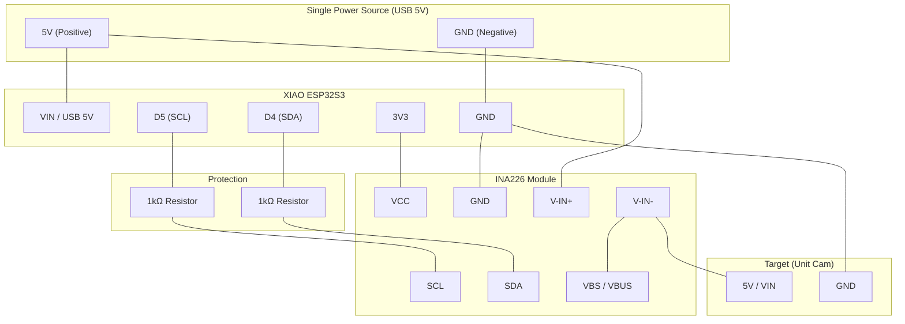
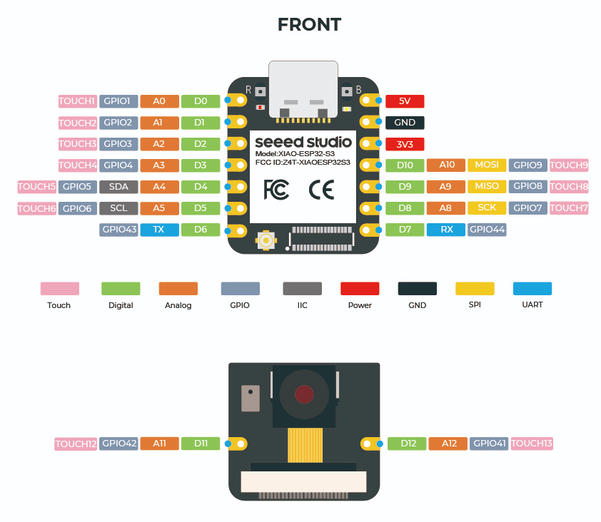
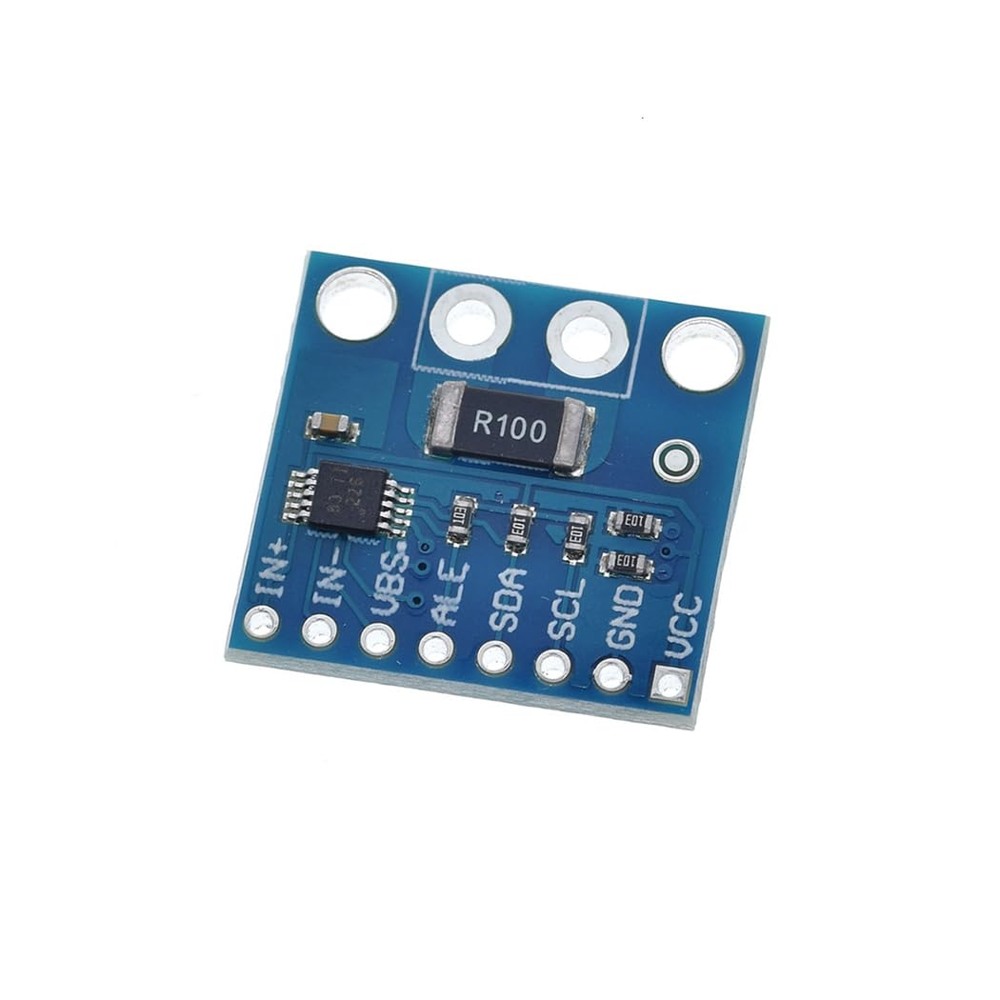

# INA226 Power Monitor (XIAO ESP32S3)

XIAO ESP32S3 + INA226 で電圧/電流/電力を計測し、SoftAP経由のWeb UIで監視するプロジェクトです。

## 目的
- ESP32系ターゲット（M5Stack Unit Cam / XIAO ESP32S3 Sense など）の電力状態をリアルタイム観測する
- 計測履歴はブラウザ側に保存し、CSVとしてダウンロードする

## 機能
- INA226 計測（Bus Voltage / Current / Power）
- CSV形式シリアル出力
- SoftAP + Web UI (`GET /`)
- JSON API (`GET /metrics`)
- IndexedDB 保存 + CSVダウンロード
- 表/折れ線グラフタブ
- 異常値ガード（invalid）と Sensor Offline 表示
- センサー未接続時もWebサーバ継続（計測スレッドで再試行）

## ハードウェア
- MCU: Seeed Studio XIAO ESP32S3
- Sensor: INA226（シャント抵抗 0.1Ω 前提）
- Target: M5Stack Unit Cam（他デバイスも可）
- 保護: I2C信号線に 1kΩ 抵抗 x2（SDA/SCL 各1本）

## 配線要点
- I2C: `SDA=GPIO5(D4)`, `SCL=GPIO6(D5)`
- INA226 address: `0x40`（既定）
- 電流計測経路: `5V source -> V-IN+ -> V-IN- -> target 5V`
- `VBS/VBUS` 端子があるモジュールは `V-IN-` へ接続
- `ALF/ALERT` は未使用なら未接続でよい
- すべての GND を共通化する
- 可能な限り同一5V電源系で給電する






## ソフトウェア構成
- `src/config.rs`: `cfg.toml` ロードとバリデーション
- `src/model.rs`: `Sample` モデル（`power_monitor_core` を再公開）
- `src/monitor.rs`: INA226計測ループ、I2C探索、再初期化リトライ
- `src/web.rs`: SoftAP起動、HTTP API、Web UI配信
- `src/main.rs`: 初期化とオーケストレーション
- `crates/power_monitor_core`: ハードウェア非依存ロジック（単体テスト対象）

## 設定
`cfg.toml.template` を元に `cfg.toml` を作成して利用します。

主な項目:
- AP: `ap_ssid`, `ap_password`, `ap_channel`
- INA226: `ina226_addr`, `shunt_resistor_ohm`, `i2c_frequency_hz`
- Sampling: `sample_interval_ms`
- Guard: `invalid_guard_enabled`, `bus_voltage_min_v`, `bus_voltage_max_v`

## ビルド / 書き込み
```bash
cd devices/ina226_power_monitor
. /Users/junkei/esp/v5.1.6/esp-idf/export.sh
cargo build
cargo espflash flash --monitor --port /dev/cu.usbmodem101
```

## アクセス
- SoftAPに接続後、`http://192.168.71.1/`

## テスト計画
### 単体テスト（ホスト）
- `Sample::to_json` のフィールド/エスケープ検証
- `format_addrs`/`resolve_ina226_address` の補助ロジック検証
- 異常値ガード判定の検証

実行:
```bash
cd devices/ina226_power_monitor
cargo test --manifest-path crates/power_monitor_core/Cargo.toml --target aarch64-apple-darwin
```

### 実機テスト
- 起動時に I2C 検出と HTTP (`/`, `/metrics`) が応答する
- 正常時に `bus_voltage_v/current_ma/power_mw` が妥当な値で更新される
- センサー断時に WebUI が `Sensor Offline` 表示になり、保存件数が増えない
- Guard閾値逸脱時に `invalid` になり保存停止する
- グラフ表示が指定範囲（30秒/1分/3分/5分/10分/全データ）で動作する
