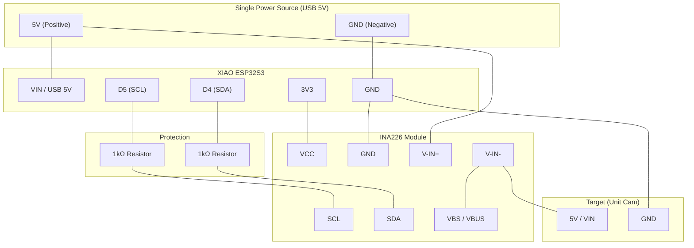

# INA226を用いた電力モニタリングシステム

## 1. 目的
XIAO ESP32S3 + INA226 を使い、ESP32系ターゲット（M5Stack Unit Cam / XIAO ESP32S3 Sense など）の電圧・電流・電力をリアルタイムに計測する。

## 2. ハードウェア
- MCU: [Seeed Studio XIAO ESP32S3](https://wiki.seeedstudio.com/ja/xiao_esp32s3_getting_started/)
- Sensor: [INA226（シャント抵抗 0.1Ω 前提）](https://www.amazon.co.jp/dp/B0DMDJJFYB?ref=ppx_yo2ov_dt_b_fed_asin_title)
- Target: [M5Stack Unit Cam（他デバイスも計測対象）](https://www.switch-science.com/products/7231?variant=42382149091526)
- I2C信号線保護: 1kΩ 抵抗 × 2

### 配線

:::warn

    - **保護抵抗:** XIAOのSDA/SCLとINA226の間に **1kΩ** を直列に挿入。これにより、電源投入順序のズレによるバックパワー電流からXIAOのGPIOを守る。
    - **給電方針:** 全てのデバイスの電源は、可能な限り**同一の5V電源から供給**すること。ESP32S3に直接USB給電を行いながら、INA226, M5Stack Unit Camに別電源から給電しない。
    - **VBUS接続:** `VBS / VBUS` 端子があるINA226モジュールは、**`V-IN-`（負荷側5Vノード）へ接続し、ターゲットに供給されている実電圧を測定する**。
    - **GND:** 全てのGNDを1箇所で強固に結合し、電位差を排除する。
    - `V-IN+ -> V-IN-` は「計測対象へ流れる電流」を測るための直列経路。
    - `ALF / ALERT` は閾値割り込みを使わない限り未接続でよい。

:::

## 3. ソフトウェア要件
- 言語: Rust
- ベース: esp-idf-template (std)
- 主クレート:
  - `esp-idf-hal`
  - `ina226`
  - `esp-idf-svc` (HTTP / Wi-Fi AP)

### 物理層・通信の堅牢化

1. **I2Cエラーハンドリング:** `ina226` クレートの呼び出しにおいて、`E::IO` エラーが発生した場合（配線抜けやチップハング）、パニックさせずにリトライまたはWeb画面上に「Sensor Offline」を表示する。
2. **起動シーケンス:** Wi-Fi起動（高負荷）の前に、I2Cデバイスの存在確認（WhoAmIレジスタ等の確認）を行い、正常な場合のみ計測ループを開始する。

### 機能
1. I2C初期化: GPIO5/6, Address 0x40（`cfg.toml`で周波数を設定。デフォルト100kHz、必要に応じて400kHz）
2. INA226設定: シャント抵抗 0.1Ω, Averaging設定
3. データ出力: Bus[V], Current[mA], Power[mW] をCSV出力
4. Webモニタリング:
   - XIAO ESP32S3をWebサーバとして動作させる
   - `GET /metrics` で最新計測値(JSON)を返す
   - `GET /` で監視用HTMLを返す
5. ブラウザ側データ保持:
   - 計測履歴はブラウザのIndexedDBに保持（ESP32側で長期保持しない）
   - Web画面からCSVを生成・ダウンロード可能にする
6. サンプリング保護: 計測値が異常（Bus電圧が0Vや極端な値）な場合、Web UI上で警告を表示し、IndexedDBへの書き込みを一時停止するガード処理。

### Web UI補足
- デフォルトはXIAO ESP32S3をSoftAPとして起動し、ブラウザから直接接続して監視する。
- データ永続化はIndexedDBを利用し、ページ再読み込み後も履歴を保持する。

## 3.1 設定ファイル（cfg.toml）
- 起動設定は `cfg.toml` で管理する。
- 初回は `cfg.toml.template` を `cfg.toml` にコピーして使用する。
- 主な設定項目:
  - `ap_ssid`, `ap_password`, `ap_channel`
  - `measurement_target`
  - `ina226_addr`, `shunt_resistor_ohm`
  - `i2c_frequency_hz`, `sample_interval_ms`

## 3.2 実装構成（責務分割）
- `src/config.rs`: `cfg.toml` のロードとバリデーション
- `src/model.rs`: 計測データモデル（Sample）
- `src/monitor.rs`: INA226計測ループとI2C探索
- `src/web.rs`: Wi-Fi AP起動、HTTP API、Web UI配信
- `src/main.rs`: 初期化と各モジュールのオーケストレーション

:::info `src/monitor.rs` の実装

    * `Result` 型を積極的に使い、I2C通信失敗時に `esp_idf_hal::delay` を挟んで再初期化を試みるロジックを実装。
    * 測定失敗時もWebサーバが落ちないよう、非同期（または別スレッド）で計測を回す。

:::

## 4. 計測目安
- Wi-Fiアクティブ時: 100mA〜150mAスパイクを観測
- Deep Sleep時: uA〜mAオーダーを観測
