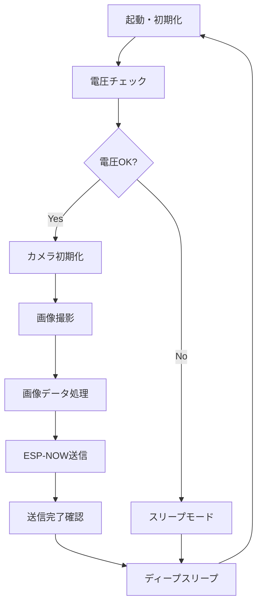

# ESP32 M5Stack Unit Cam - Image Sensor Data Sender

[M5Stack Unit Cam Wi-Fi Camera (OV2640)](https://docs.m5stack.com/en/unit/unit_cam)を使用したESP32ベースの画像センサーデータ送信システムです。効率的で保守しやすいモジュラー構造により、安定した画像撮影・送信機能を提供します。

## 🎯 プロジェクト概要

このプロジェクトは、ESP32マイクロコントローラーとOV2640カメラモジュールを使用して、以下の機能を提供します：

### 🌟 主要機能

- **📸 自動画像撮影**: 定期的な高品質画像キャプチャ（OV2640カメラ）
- **📡 ESP-NOW通信**: 200バイトチャンク・100ms間隔で堅牢な高速画像送信
- **🔋 サーバー制御スリープ**: サーバーからの動的スリープ時間指示による電力効率化
- **⚡ 効率的データ処理**: 状態管理とエラーハンドリング付きチャンク分割送信
- **🔍 データ整合性**: SHA256ハッシュによる画像データ検証
- **💡 ステータス表示**: LEDによる動作状態の視覚的フィードバック
- **🌐 IoT連携**: FarmVerseプラットフォームとの統合・InfluxDB記録
- **⚡ 電圧監視**: 全電圧レベル（0-100%）の監視と低電圧保護
- **⚙️ 外部設定**: TOML設定ファイルによる柔軟なカスタマイズ
- **🛡️ 堅牢性**: 包括的エラーハンドリングと状態リセット機能

## 🏗️ アーキテクチャ

### モジュラー構造

```
📁 src/
├── 🎯 core/                    # コアシステム
│   ├── config.rs              # 設定管理・TOML解析
│   ├── app_controller.rs      # アプリケーション制御・スリープ管理
│   ├── data_service.rs        # データ収集・送信サービス
│   └── rtc_manager.rs         # RTC時刻管理
├── 🔧 hardware/               # ハードウェア制御
│   ├── camera/                # OV2640カメラ制御
│   ├── led/                   # ステータスLED制御
│   ├── pins.rs                # GPIO ピン管理
│   └── voltage_sensor.rs      # ADC電圧監視
├── 📡 communication/          # 通信機能
│   ├── esp_now/               # ESP-NOW プロトコル実装
│   └── network_manager.rs     # WiFi・ネットワーク管理
├── 🔋 power/                  # 電源管理
│   └── sleep/                 # ディープスリープ制御
└── 📍 mac_address.rs          # MACアドレス処理
```

### 🔄 データフロー



## 🚀 機能詳細

### 📸 スマート画像撮影
- **電圧監視**: ADC電圧8%以下で撮影スキップ
- **品質最適化**: ウォームアップフレームによる画質安定化
- **解像度設定**: SVGA (800x600) から QSXGA (2592x1944) まで対応
  - ⚠️ **注意**: M5Stack Unit Cam (ESP32-WROOM-32E) はメモリ制限により、SVGA以上の解像度ではメモリ不足エラーが発生する可能性があります

### 📡 効率的通信
- **ESP-NOW**: WiFiルーター不要の直接通信
- **堅牢な送信**: 200バイトチャンク、100ms間隔による安定送信
- **状態管理**: 包括的エラーハンドリングと自動状態リセット
- **スリープ制御**: サーバーからの動的スリープ時間指示を受信
- **メモリ管理**: 適切なリソース管理によるメモリリーク防止

### 🔋 電源最適化
- **サーバー制御スリープ**: HASHフレーム送信後、サーバーからスリープ時間を受信
- **低電圧保護**: 8%未満でスリープ時間延長、画像送信スキップ
- **タイミング制御**: 複数デバイス運用時の送信時刻分散

## 🛠️ セットアップ

### 必要条件

- **Rust** 1.70以上 + ESP32ツールチェーン
- **cargo-espflash** ESP32フラッシュツール
- **M5Stack Unit Cam** (ESP32 + OV2640カメラ)
- **ESP-IDF** 5.0以上

### インストール

1. **ESP32 Rustツールチェーンのセットアップ**
   ```bash
   # espupツールのインストール
   cargo install espup
   espup install
   
   # 環境変数の設定
   . $HOME/export-esp.sh
   
   # espflashツールのインストール
   cargo install cargo-espflash
   ```

2. **プロジェクトのクローン**
   ```bash
   git clone <repository-url>
   cd FarmVerse/devices/m5stack_unit_cam
   ```

3. **設定ファイルの作成**
   ```bash
   cp cfg.toml.template cfg.toml
   # cfg.tomlを編集して設定をカスタマイズ
   ```

4. **ビルドとフラッシュ**
   ```bash
   # デバッグビルド
   cargo build
   
   # リリースビルド
   cargo build --release
   
   # ESP32にフラッシュ（シリアルポートは環境に合わせて変更）
   cargo espflash flash --release --port /dev/tty.usbserial-xxxxxxxx --monitor --partition-table partitions.csv
   
   # macOSの場合のポート例
   # /dev/tty.usbserial-xxxxxxxx または /dev/tty.SLAB_USBtoUART
   
   # Linuxの場合のポート例  
   # /dev/ttyUSB0 または /dev/ttyACM0
   
   # Windowsの場合のポート例
   # COM3 または COM4
   ```

## ⚙️ 設定

### cfg.toml設定項目

| 項目 | 説明 | デフォルト値 |
|------|------|--------------|
| `receiver_mac` | 送信先MACアドレス | "11:22:33:44:55:66" |
| `timezone` | タイムゾーン | "Asia/Tokyo" |
| `sleep_duration_seconds` | 通常スリープ時間(秒) | 60 |
| `sleep_duration_seconds_for_long` | 長時間スリープ時間(秒) | 3600 |
| `sleep_command_timeout_seconds` | スリープコマンド待機タイムアウト(秒) | 10 |
| `frame_size` | カメラ解像度 ⚠️ M5Stack Unit CamはSVGA推奨 | "SVGA" |
| `auto_exposure_enabled` | 自動露光調整 | true |
| `camera_warmup_frames` | ウォームアップフレーム数 | 2 |
| `adc_voltage_min_mv` | ADC電圧測定最小値(mV) - キャリブレーション用 | 128.0 |
| `adc_voltage_max_mv` | ADC電圧測定最大値(mV) - キャリブレーション用 | 3130.0 |
| `target_minute_last_digit` | 送信タイミング制御（分の最後の桁） | 0 |
| `target_second_last_digit` | 送信タイミング制御（秒の最後の桁） | 0 |

### 🔧 重要な設定項目の詳細

#### スリープコマンドタイムアウト
- **`sleep_command_timeout_seconds`**: サーバーからのスリープコマンド待機時間
- **推奨値**: 10秒（通信遅延を考慮）
- **注意**: 値が小さすぎるとスリープコマンドを受信前にタイムアウトする可能性

#### ADC電圧キャリブレーション
- **`adc_voltage_min_mv`**: 電圧0%時のADC読み取り値（mV）
- **`adc_voltage_max_mv`**: 電圧100%時のADC読み取り値（mV）
- **キャリブレーション方法**: 
  1. 最低電圧時のADC値を測定し、`adc_voltage_min_mv`に設定
  2. 最高電圧時のADC値を測定し、`adc_voltage_max_mv`に設定
  3. これにより0-100%の電圧パーセンテージが正確に計算される

### ピン配置 (M5Stack Unit Cam)

| 機能 | GPIO | 説明 |
|------|------|------|
| LED | GPIO4 | ステータス表示 |
| 電圧センサー | GPIO0 | ADC電圧測定 ⚠️ **重要**: 起動時注意 |
| カメラクロック | GPIO27 | OV2640 XCLK |
| カメラデータ | GPIO32,35,34,5,39,18,36,19 | D0-D7 |
| カメラ制御 | GPIO22,26,21 | VSYNC,HREF,PCLK |
| I2C | GPIO25,23 | SDA,SCL |

#### ⚠️ GPIO0 (電圧センサー) 取り扱い注意

**GPIO0は起動モード制御ピンです。取り扱いには十分注意してください：**

1. **初回起動時**: GPIO0をショートさせず、通常起動させる
2. **初回ディープスリープ確認**: デバイスが正常にディープスリープに入ったことを確認
3. **電圧測定開始**: ディープスリープ確認後にGPIO0をショートさせる

**⚠️ 警告**: デバイス起動時（電源投入時やリセット時）にGPIO0がGNDにショートしていると、ESP32がブートモードに入り正常に動作しません。

## 🔄 システム連携

### FarmVerse エコシステム

```
┌─────────────────┐    ESP-NOW   ┌─────────────────┐    HTTP/WebSocket   ┌─────────────────┐
│  M5Stack Unit   │ ──────────── │   Receiver      │ ─────────────────── │  FarmVerse      │
│  Cam (Sender)   │              │   (ESP32/PC)    │                     │  Server         │
└─────────────────┘              └─────────────────┘                     └─────────────────┘
```

### 受信機との連携

このプロジェクトは、以下の受信機と連携します：
- **ESP32受信機**: `../examples/usb_cdc_receiver/` - USB CDC経由でPC送信
- **PC受信機**: `../../server/sensor_data_reciver/` - InfluxDB記録・Web API提供

### サーバーサイド機能
- **InfluxDB統合**: 全電圧レベル（0-100%）の自動記録
- **async処理**: 堅牢なタスク管理とメモリリーク防止
- **動的スリープ制御**: 電圧レベルに応じた最適スリープ時間の指示
- **画像保存**: 受信画像の自動保存とメタデータ管理

詳細は各プロジェクトのREADMEを参照してください。

## 🧪 開発・テスト

### ログ監視
```bash
# シリアル出力監視（フラッシュと同時）
cargo espflash flash --release --port /dev/tty.usbserial-xxxxxxxx --monitor --partition-table partitions.csv

# すでにフラッシュ済みの場合のモニターのみ
cargo espflash monitor --port /dev/tty.usbserial-xxxxxxxx

# ログレベル調整
export RUST_LOG=debug
cargo espflash flash --release --port /dev/tty.usbserial-xxxxxxxx --monitor --partition-table partitions.csv
```

### デバッグ機能
- **LEDステータス**: 
  - 点灯: 処理中
  - 短い点滅: 成功
  - 長い点滅: エラー
- **電圧監視**: ADC電圧8%以下で撮影スキップ
- **ハッシュ検証**: データ整合性確認

### トラブルシューティング

| 問題 | 原因 | 解決方法 |
|------|------|----------|
| カメラ初期化失敗 | ピン接続・電源 | 配線確認、電圧測定 |
| ESP-NOW送信失敗 | MACアドレス・距離・状態 | 設定確認、受信機の状態、ESP-NOW状態リセット |
| 頻繁なスリープ | ADC電圧低下 | 電源供給の改善 |
| メモリ不足エラー | 高解像度設定 | frame_sizeをSVGA以下に変更 |
| デバイス起動失敗 | GPIO0ショート | 起動時はGPIO0をオープンにする |
| ブートモードに入る | GPIO0がGNDにショート | GPIO0の接続を確認、起動後に接続 |
| 送信が途中で止まる | ESP-NOW状態異常 | 状態リセット機能が自動的に復旧 |
| スリープコマンド未受信 | タイムアウト設定 | sleep_command_timeout_secondsを調整 |

### ログ解析のポイント
- **ESP-NOW状態**: `ESP-NOW state reset`ログで状態管理を確認
- **電圧監視**: `Voltage: XX%`で電源状態を監視
- **送信進捗**: `Chunk XX/XX sent`で送信状況を追跡
- **エラー詳細**: 各種エラーログで問題箇所を特定

## 📊 パフォーマンス

### パフォーマンス・メトリクス
- **画像サイズ**: ~30KB (SVGA, JPEG圧縮)
- **送信時間**: ~15-20秒 (200バイトチャンク、100ms間隔)
- **通信距離**: ~100m (見通し良好時)
- **電力効率**: サーバー制御スリープによる最適化
- **メモリ使用量**: 堅牢なリソース管理によるメモリリーク防止

### 信頼性・安定性
- **エラーハンドリング**: 包括的な例外処理とログ出力
- **状態管理**: ESP-NOW送信の確実な状態リセット
- **リソース管理**: 適切なメモリ・タスク管理
- **データ検証**: SHA256ハッシュによる画像整合性確認

## 🔧 カスタマイズ

### 解像度変更
```toml
# cfg.toml
frame_size = "VGA"  # 640x480（M5Stack Unit Camで安全）
# frame_size = "QVGA"  # 320x240（より低解像度、メモリ使用量少）
# frame_size = "SVGA"  # 800x600（デフォルト、推奨最大）
```
⚠️ **注意**: M5Stack Unit Cam (ESP32-WROOM-32E) では、SVGA以上の解像度は避けてください。

### 送信間隔調整
```toml
# cfg.toml
sleep_duration_seconds = 300  # 5分間隔
```

### 複数デバイス運用
```toml
# cfg.toml
target_minute_last_digit = 0  # 毎時x0分に送信
target_second_last_digit = 1  # 毎分x1秒に送信
```

## 📄 ライセンス

このプロジェクトはMITライセンスの下で公開されています。詳細は[LICENSE](../../LICENSE)ファイルを参照してください。

---

**FarmVerse Project** - 持続可能な農業のためのIoTプラットフォーム

## 🔄 最新の実装状況

### ✅ 完了した機能・改良

#### ESP-NOW通信の堅牢性向上
- **状態管理**: 送信前の自動状態リセットによる確実な通信
- **エラーハンドリング**: 包括的なエラー処理と適切なログ出力
- **チャンキング最適化**: 200バイト固定、100ms間隔による安定送信
- **メモリ管理**: リソースリークを防ぐ適切なクリーンアップ

#### サーバー側統合
- **InfluxDB async処理**: 非同期書き込みによる高パフォーマンス
- **タスク管理**: asyncタスクトラッキングによるメモリリーク防止
- **全電圧レベル記録**: 0-100%の電圧データを確実にInfluxDBに記録
- **動的スリープ制御**: HASHフレーム後の適切なスリープコマンド送信

#### 設定外部化・柔軟性向上
- **TOML設定**: 全設定項目の外部ファイル化
- **ADC電圧キャリブレーション**: adc_voltage_min/max_mvによる精密調整
- **スリープタイムアウト制御**: sleep_command_timeout_secondsで待機時間調整
- **タイミング制御**: target_minute/second_last_digitによる送信時刻分散

#### 品質・保守性向上
- **包括的テスト**: 53個のテストによる高いコードカバレッジ
- **統合テスト**: 実際の通信フローを検証するend-to-endテスト
- **ドキュメント**: 設定項目・トラブルシューティングの詳細化
- **コード品質**: リファクタリングによるモジュラー構造の実現

### 🚀 パフォーマンス改善
- **ESP-NOW**: 名前付き定数使用、マジックナンバー排除
- **Rust**: MaybeUninit使用による安全なメモリ操作
- **Server**: asyncio.gather使用による効率的な並行処理
- **リソース**: Mutexの最適化とFreeRTOS安全API使用