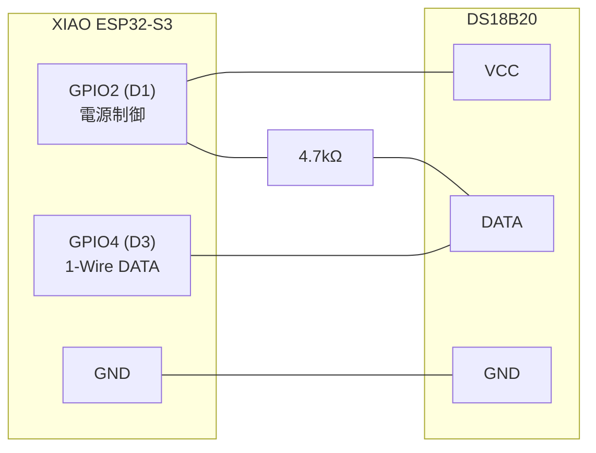

# XIAO ESP32-S3 温度センサー (DS18B20)

XIAO ESP32-S3 + DS18B20 で 10 分ごとに温度を計測し、ESP-NOW で `usb_cdc_receiver` ゲートウェイに送信するモジュールです。

## 目的

- DS18B20 で環境温度をワイヤレス計測する
- Deep Sleep で電力を最小化し、バッテリー駆動期間を最大化する
- ESP-NOW で既存の `sensor_data_reciver` インフラにデータを届ける

## ハードウェア

| 部品 | 型番 |
|------|------|
| MCU | Seeed Studio XIAO ESP32-S3 |
| 温度センサー | DS18B20 (防水タイプ推奨) |
| プルアップ抵抗 | 4.7 kΩ (DATA ライン用) |

## 配線

```
DS18B20               XIAO ESP32-S3
─────────────────────────────────────
VCC  ────────────────  D1 (GPIO2)   ← 電源制御 (計測時 HIGH / スリープ前 LOW)
DATA ─── 4.7kΩ ─── ── D3 (GPIO4)   ← 1-Wire データ
GND  ────────────────  GND
```

> **注意**: 4.7 kΩ プルアップ抵抗は DATA と VCC (GPIO2) の間に接続する。
> スリープ前に GPIO2 を LOW に落とすことで、プルアップ経由の電流リークを防ぐ。



## ソフトウェア構成

```
devices/xiao_esp32s3_temp_sensor/
├── src/
│   ├── lib.rs                     # ライブラリルート (pub mod utils)
│   ├── main.rs                    # バイナリエントリポイント・WiFi/ESP-NOW 初期化
│   └── utils/                     # ハードウェア非依存ロジック（ホストテスト対象）
│       ├── mod.rs
│       ├── mac_utils.rs           # parse_mac + テスト
│       ├── payload.rs             # format_hash_payload + テスト
│       └── recalibration.rs      # needs_recalibration + テスト
├── Cargo.toml
├── cfg.toml.template              # 設定テンプレート
├── sdkconfig.defaults             # ESP-IDF Kconfig
└── docs/
    ├── design.md                  # 設計詳細・プロトコル仕様
    ├── ina226_samples_esp32s3_tempsensor.csv    # 電力計測データ (最適化前)
    └── ina226_samples_esp32s3_tempsensor_2.csv  # 電力計測データ (最適化後)
```

### 主要な機能 (src/main.rs)

| 関数 | 役割 |
|------|------|
| `main()` | 温度計測 → ESP-NOW 送信 → Deep Sleep のサイクル制御 |
| `sleep_or_delay()` | `use_deep_sleep` に応じて Deep Sleep / FreeRTOS delay を切替 |
| `init_esp_now()` | WiFi STA 起動・PHY キャリブレーション管理・ESP-NOW ピア登録 |
| `send_temperature()` | 生テキスト HASH ペイロードと "EOF!" を ESP-NOW 送信 |
| `should_force_recalibrate()` | RTC メモリのサイクルカウンタで再キャリブレーションタイミングを判定 |
| `erase_phy_calibration()` | `esp_phy_erase_cal_data_in_nvs()` で NVS のキャリブレーションデータを消去 |

### ハードウェア非依存コア (src/utils/)

ホスト (macOS/Linux) で単体テストできる純粋関数群。

| 関数 | 役割 |
|------|------|
| `parse_mac(s)` | "XX:XX:XX:XX:XX:XX" → `[u8; 6]` |
| `needs_recalibration(cycle, interval)` | `cycle % interval == 0` で再キャリブレーション判定 |
| `format_hash_payload(temp)` | usb_cdc_receiver 向け HASH テキストペイロード生成 |

## 設定 (cfg.toml)

`cfg.toml.template` を `cfg.toml` にコピーして使用する (`cfg.toml` は .gitignore 済み)。

```toml
[xiao-esp32s3-get-temperature]

# 計測間隔 (秒) デフォルト: 600 = 10分
measure_interval_s = 600

# Deep Sleep: true = 省電力, false = FreeRTOS delay (USB モニタリング可)
use_deep_sleep = false

# ESP-NOW 送信先 MAC アドレス (wifi feature 使用時のみ必要)
receiver_mac = "11:22:33:44:55:66"

# WiFi チャンネル (0=自動スキャン / 1-13=固定)
# ゲートウェイ起動ログ "WiFiチャンネル: Primary: N" で確認し固定すると省電力
wifi_channel = 0

# PHY 再キャリブレーション周期 (deep_sleep=true 時のみ有効)
# 0=無効 / N=N サイクルごとに NVS キャリブレーションデータを消去して再キャリブレーション
recalibration_interval = 100
```

## ビルド・書き込み

```bash
cd devices/xiao_esp32s3_temp_sensor

# ESP-IDF + Rust ツールチェーンを有効化
. ~/.espressif/esp-idf/v5.3.2/export.sh
. ~/export-esp.sh

# Phase 1: ログのみ (WiFi なし)
cargo espflash flash --release --monitor --port /dev/cu.usbmodem101

# Phase 2: ESP-NOW 送信あり
cp cfg.toml.template cfg.toml
# cfg.toml の receiver_mac をゲートウェイ MAC に設定してから:
cargo espflash flash --features wifi --release --monitor --port /dev/cu.usbmodem101
```

## テスト

### ホスト単体テスト (ハードウェア不要)

```bash
cd devices/xiao_esp32s3_temp_sensor
cargo test --lib --target aarch64-apple-darwin
```

カバレッジ対象:

| テストグループ | 内容 |
|--------------|------|
| `parse_mac_*` | 正常変換・区切り文字違い・無効 hex・セグメント数不正 など 9 ケース |
| `recal_*` | 初回/中間/境界サイクル・interval=0 無効化・u32::MAX ラップ など 6 ケース |
| `payload_*` | HASH プレフィックス・64 桁ゼロハッシュ・温度フォーマット・センチネル値 など 9 ケース |

### 実機テスト

1. **Phase 1 (WiFi なし)**: シリアルモニタで 10 分ごとに `Temperature: xx.xx°C` が出力される
2. **Phase 2 (WiFi あり)**: `sensor_data_reciver` 側の InfluxDB に温度データが書き込まれる
3. **Deep Sleep 動作**: スリープ中の電流が ≤ 0.5 mA であることを INA226 で確認

---

## 電力消費分析

> **計測ツール**: [devices/ina226_power_monitor](../ina226_power_monitor/README.md)  
> INA226 (シャント抵抗 0.1 Ω) を XIAO ESP32-S3 の電源ライン (5 V) に直列挿入し、
> SoftAP Web UI から 1 秒間隔でサンプリングして CSV ダウンロード。

計測条件:
- **ターゲット**: XIAO ESP32-S3 (温度センサー接続)
- **電源**: USB 5 V (測定は VIN ライン)
- **サイクル**: Deep Sleep 30 秒 + 起動・計測・送信 約 2 秒 / サイクル
- **INA226 サンプリング**: 1 秒間隔

### 計測 1: 最適化前

**設定**: `wifi_channel = 0` (自動スキャン) / `use_deep_sleep = true` / PHY キャリブレーション NVS 保存なし

| 状態 | 平均電流 | 最大電流 | サンプル数 |
|------|----------|----------|----------|
| スリープ | **0.20 mA** | 0.20 mA | 239 |
| アクティブ | **78.4 mA** | 93.5 mA | 15 |

生データ: [docs/ina226_samples_esp32s3_tempsensor.csv](docs/ina226_samples_esp32s3_tempsensor.csv)

アクティブ時の主な電流要因:
- WiFi チャンネルスキャン (0 = 自動): 全チャンネルをスキャンするため時間・電力を消費
- PHY フルキャリブレーション: 毎起動実行 (NVS 保存なし)
- ESP-NOW TX: ピーク ~350 mA / 約 4 ms → 1 秒平均では ~90 mA に収束

### 計測 2: 最適化後

**設定**: `wifi_channel = 1` (固定) / `use_deep_sleep = true` / `CONFIG_ESP_PHY_CALIBRATION_AND_DATA_STORAGE=y`

| 状態 | 平均電流 | 最大電流 | サンプル数 |
|------|----------|----------|----------|
| スリープ | **0.23 mA** | 0.60 mA | 261 |
| アクティブ | **36.6 mA** | 65.4 mA | 18 |

生データ: [docs/ina226_samples_esp32s3_tempsensor_2.csv](docs/ina226_samples_esp32s3_tempsensor_2.csv)

改善の内訳:
- チャンネルスキャン廃止 (`wifi_channel = 1`): 約 100 ms・数十 mAs を削減 → **最大の改善要因**
- PHY キャリブレーション NVS キャッシュ: 約 100 ms・35 mAs を削減
- 温度計測を WiFi 起動前に実施: 計測失敗時は WiFi をスキップして省電力

### 最適化前後の比較

| 指標 | 最適化前 | 最適化後 | 変化 |
|------|----------|----------|------|
| アクティブ電流 (平均) | 78.4 mA | 36.6 mA | **▼ 53%** |
| スリープ電流 (平均) | 0.20 mA | 0.23 mA | ほぼ同等 |
| アクティブ電流 (最大) | 93.5 mA | 65.4 mA | ▼ 30% |

> スリープ電流の 0.23 mA (計測 2) は起動直後の 0.6 mA サンプルを含む平均値。
> 安定期は計測 1 と同様の 0.20 mA。

### バッテリー寿命試算 (10 分間隔・1000 mAh 電池)

10 分サイクル (600 s) の消費エネルギー:

**最適化前**
```
アクティブ: 78.4 mA × 2 s  =  156.8 mAs = 0.0436 mAh
スリープ  :  0.20 mA × 598 s = 119.6 mAs = 0.0332 mAh
合計/サイクル                              0.0768 mAh
1日 (144 サイクル)                        11.1 mAh/日
寿命 (1000 mAh)                           ≈ 90 日
```

**最適化後**
```
アクティブ: 36.6 mA × 2 s  =   73.2 mAs = 0.0203 mAh
スリープ  :  0.20 mA × 598 s = 119.6 mAs = 0.0332 mAh
合計/サイクル                              0.0535 mAh
1日 (144 サイクル)                         7.7 mAh/日
寿命 (1000 mAh)                           ≈ 130 日
```

> **バッテリー寿命 +44%** (90 日 → 130 日)  
> アクティブ時間を 2 s と仮定。実際は WiFi 起動成否や温度センサー応答時間により変動する。

### 残存する電力課題

- スリープ電流 0.20 mA の大半は XIAO ESP32-S3 ボード上の LDO レギュレータ・USB チップの待機電流
- ESP32-S3 チップ単体の Deep Sleep は約 14 µA だが、XIAO ボードの回路設計上これ以上の削減は困難
- さらなる省電力化には外部 MOSFET でボード全体の電源を制御する必要がある

---

## ESP-NOW プロトコル

`usb_cdc_receiver` (ESP32-C3 ゲートウェイ) への送信フォーマット:

```
# パケット 1: HASH テキストペイロード (生テキスト, バイナリフレームなし)
HASH:0000...0000,VOLT:100,TEMP:25.3,TDS_VOLT:-999.0,2000/01/01 00:00:00.000

# パケット 2: EOF マーカー
EOF!
```

- `VOLT:100` ― 電圧センサー非搭載のプレースホルダ
- `TDS_VOLT:-999.0` ― TDS センサー非搭載のセンチネル値 (サーバー側で `None` として扱われる)
- `usb_cdc_receiver` の `detect_frame_type` が先頭テキストでフレーム種別を識別し、ESP32-C3 側でバイナリフレームを組み立てて USB CDC 経由でホストに転送する

詳細は [docs/design.md](docs/design.md) を参照。
