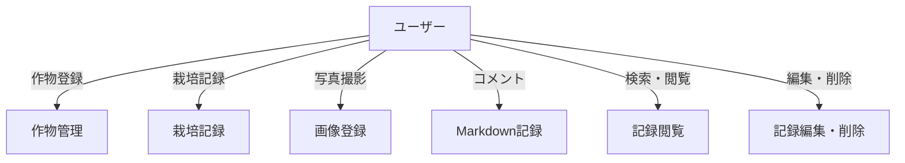

<!-- filepath: /workspaces/FarmVerse/docs/1_CultivationDiary/basic_design/03_ユースケース.md -->
# ユースケース

## ユースケース図

## 共通
- 栽培する作物の登録・編集・削除
- 栽培記録（イベント）の登録・閲覧・編集・削除
- イベントごとにタグ付け（播種、定植、施肥、追肥、収穫、防除、その他）
- 施肥・追肥・収穫時は「どの作物に」「どのくらい」か入力
- 写真撮影・画像登録（スマホカメラ対応）
- コメント（Markdown形式）入力
- 栽培記録のタイムライン表示
- 記録の検索・フィルタリング
- 家族/友人との共有
- サポート・Q&A・ヘルプ

## ペルソナ別ユースケース

### 1. 忙しい共働き子育て世帯
- 子どもと一緒に栽培記録をつける
- スマホで栽培状況を確認・遠隔管理
- 水やりや環境管理の自動化通知を受け取る
- 食育イベントやレシピ提案を受ける

### 2. 単身者・DINKS
- おしゃれなUIで栽培状況を管理
- 栽培記録をSNS等でシェア
- スマート通知で水やり・収穫タイミングを把握
- インテリア性の高い写真記録

### 3. シニア層
- 操作が簡単なガイド付き記録
- 栽培記録を家族や友人と共有
- 困った時のサポート・ヘルプ機能
- 健康管理やコミュニティ参加のきっかけとして活用
