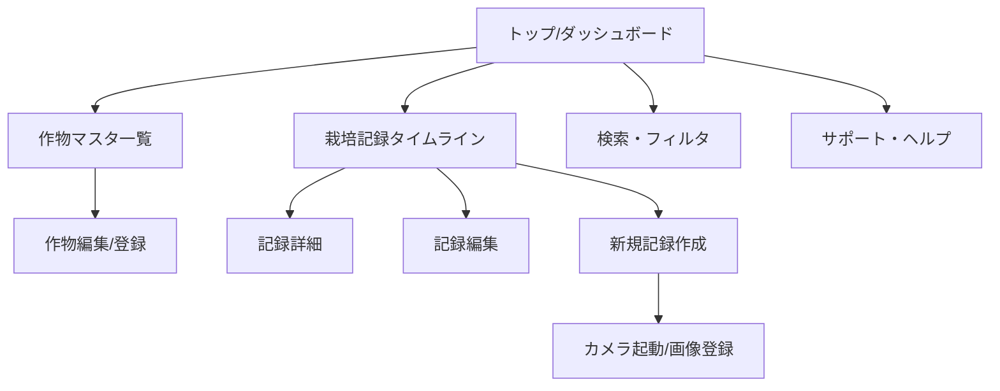
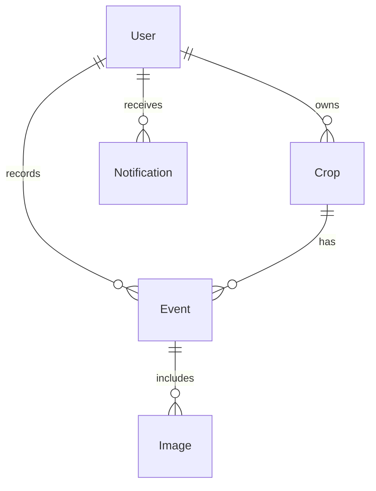

<!-- filepath: /workspaces/FarmVerse/docs/1_CultivationDiary/basic_design/07_画面設計データ設計API設計.md -->
# 画面設計・データ設計・API設計

## 1. 画面設計

### 主要画面一覧
- トップ画面（ダッシュボード）
- 作物マスタ一覧・登録・編集画面
- 栽培記録タイムライン画面
- 栽培記録詳細・編集画面
- 新規記録作成画面（カメラ・Markdown・タグ選択）
- 画像一覧・詳細画面
- 検索・フィルタ画面
- サポート・ヘルプ画面

### 画面遷移図


---

## 2. データ設計

### 主なエンティティと属性
| エンティティ | 主な属性 |
|---|---|
| User（ユーザー） | id, name, email, password, role, ... |
| Crop（作物） | id, name, type, memo, user_id, ... |
| Event（栽培記録） | id, crop_id, user_id, event_type, date, amount, comment_md, image_id, tags, ... |
| Image（画像） | id, url, event_id, created_at, ... |
| Notification（通知） | id, user_id, type, message, read, created_at, ... |

### ER図（簡易）


---

## 3. API設計（例: REST）

| メソッド | エンドポイント | 概要 |
|---|---|---|
| GET | /api/crops | 作物一覧取得 |
| POST | /api/crops | 作物登録 |
| PUT | /api/crops/{id} | 作物編集 |
| DELETE | /api/crops/{id} | 作物削除 |
| GET | /api/events | 栽培記録一覧取得（検索・フィルタ対応） |
| POST | /api/events | 栽培記録登録 |
| GET | /api/events/{id} | 記録詳細取得 |
| PUT | /api/events/{id} | 記録編集 |
| DELETE | /api/events/{id} | 記録削除 |
| POST | /api/images | 画像アップロード |
| GET | /api/images/{id} | 画像取得 |
| GET | /api/notifications | 通知一覧取得 |
| POST | /api/notifications | 通知送信 |

---

## 4. 主要画面ワイヤーフレーム（テキスト簡易版）

### トップ画面（ダッシュボード）
```
+---------------------------------------------------+
| [ロゴ]  [作物一覧] [新規記録] [検索] [サポート] |
+---------------------------------------------------+
| こんにちは、[ユーザー名]さん                      |
| [本日の作業リマインダー]                          |
| [最近の栽培記録タイムライン]                      |
+---------------------------------------------------+
```

### 作物マスタ一覧画面
```
+-----------------------------+
| 作物名 | メモ | 編集 | 削除 |
+-----------------------------+
| トマト | ... | [編集] [削除] |
| バジル | ... | [編集] [削除] |
+-----------------------------+
| [新規作物登録]              |
+-----------------------------+
```

### 栽培記録タイムライン画面
```
+---------------------------------------------------+
| [作物選択] [期間選択] [検索]                      |
+---------------------------------------------------+
| 日付 | 作物 | イベント | コメント | 画像 | 詳細 |
+---------------------------------------------------+
| ...                                               |
+---------------------------------------------------+
```

### 記録詳細・編集画面
```
+-----------------------------+
| 作物名: トマト              |
| 日付: 2025/06/08            |
| イベント: 収穫              |
| 量: 200g                    |
| コメント(Markdown)           |
| 画像: [サムネイル]           |
| [編集] [削除]               |
+-----------------------------+
```

### 新規記録作成画面
```
+-----------------------------+
| 作物選択: [▼]               |
| 日付: [カレンダー]           |
| イベント: [タグ選択]         |
| 量: [数値/単位]              |
| コメント: [Markdown入力欄]   |
| 画像: [カメラ/アップロード]  |
| [登録]                      |
+-----------------------------+
```

---

## 5. 詳細API仕様（例: REST）

### 作物（Crop）
- GET    /api/crops           : 作物一覧取得（クエリ: user_id, keyword, page, size）
- POST   /api/crops           : 作物登録（body: name, type, memo, user_id）
- GET    /api/crops/{id}      : 作物詳細取得
- PUT    /api/crops/{id}      : 作物編集（body: name, type, memo）
- DELETE /api/crops/{id}      : 作物削除

### 栽培記録（Event）
- GET    /api/events          : 記録一覧取得（クエリ: crop_id, user_id, event_type, date_from, date_to, keyword, page, size）
- POST   /api/events          : 記録登録（body: crop_id, user_id, event_type, date, amount, comment_md, image_id, tags）
- GET    /api/events/{id}     : 記録詳細取得
- PUT    /api/events/{id}     : 記録編集（body: event_type, date, amount, comment_md, image_id, tags）
- DELETE /api/events/{id}     : 記録削除

### 画像（Image）
- POST   /api/images          : 画像アップロード（multipart/form-data: file, event_id, user_id）
- GET    /api/images/{id}     : 画像取得

### 通知（Notification）
- GET    /api/notifications   : 通知一覧取得（クエリ: user_id, read, page, size）
- POST   /api/notifications   : 通知送信（body: user_id, type, message）

### ユーザー（User）
- GET    /api/users/{id}      : ユーザー詳細取得
- PUT    /api/users/{id}      : ユーザー編集（プロフィール編集等）

---

必要に応じて画面ごとの詳細なUI設計やAPIリクエスト/レスポンス例も追加可能です。
