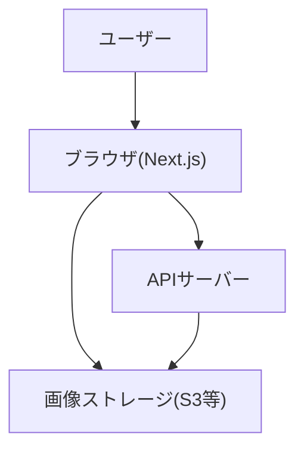

<!-- filepath: /workspaces/FarmVerse/docs/1_CultivationDiary/basic_design/10_技術スタック_アーキテクチャ.md -->
# 技術スタック・アーキテクチャ決定

## フロントエンド
- フレームワーク: **Next.js (React, TypeScript)**
  - 理由: サーバーサイドレンダリング・静的生成・APIルート・SEO・開発体験のバランスが良い。TypeScriptで型安全性も担保。
- UI: **Tailwind CSS + Headless UI**
  - 理由: ワイヤーフレーム・設計方針と一貫。アクセシビリティ・カスタマイズ性も高い。
  - 必要に応じてMUI等の導入も検討。
- 状態管理: **Zustand または Recoil**
  - 理由: 本プロジェクトは「中規模以上」に該当し、複数エンティティ・画面間でのグローバルな状態管理が必要。ZustandやRecoilはシンプルかつ拡張性・保守性に優れ、今後のプロフィール・コミュニティ機能拡張にも柔軟に対応できる。
  - 補足: React Context/Reducerは小規模な状態管理には有効だが、中規模以上では状態の分散・ネスト・パフォーマンス・保守性の観点から適さないため、今回のプロジェクトでは選択しない。
- フォーム: **React Hook Form**
  - 理由: バリデーションやパフォーマンスに優れ、TypeScriptとの相性も良い。
- Markdown: **react-markdown**
  - 理由: 軽量でシンプルにMarkdown表示が可能。必要に応じて@uiw/react-md-editor等で編集機能も拡張可能。
- 画像アップロード: **Next.js API Route + S3/Cloud Storage連携**（将来的な拡張性も考慮）
  - 理由: Next.jsのAPI Routeでサーバーサイド処理を柔軟に実装でき、S3等のクラウドストレージと連携しやすい。
- テスト: **Jest + React Testing Library**
  - 理由: Reactコンポーネントのテストに広く使われており、ドキュメントや事例も豊富。

## バックエンドAPI連携
- API方式: **REST API**（OpenAPI/Swaggerで仕様管理推奨）
  - 理由: シンプルでフロントエンド・バックエンドの分離がしやすく、API仕様の自動生成やドキュメント化も容易。
- 通信: **axios** または **fetch**
  - 理由: fetchは標準APIで軽量、axiosは機能が豊富でエラーハンドリングやリクエストキャンセル等が便利。
- 認証: **JWT認証**（将来的なOAuth/SNS連携も視野）
  - 理由: シングルページアプリやAPI連携で広く使われており、拡張性・セキュリティのバランスが良い。

## インフラ・CI/CD
- デプロイ: **Vercel/Netlify**（Next.jsとの親和性高）
  - 理由: Next.js公式推奨で、デプロイ・プレビュー・CDN配信が簡単。無料枠も充実。
- CI: **GitHub Actions**
  - 理由: GitHubリポジトリと連携しやすく、CI/CDパイプラインの自動化が容易。

## 画像保存方法
- MVP段階: サーバーのローカル or クラウドストレージ（S3等）
  - 理由: MVPではコストや構成をシンプルに保ちつつ、将来的なクラウド移行も見据える。
- 本番運用: S3等のクラウドストレージ推奨
  - 理由: 可用性・拡張性・セキュリティの観点から本番ではクラウドストレージが最適。

## Markdownエディタ
- **react-markdown** + 必要に応じて**@uiw/react-md-editor**等
  - 理由: 軽量で導入が容易。編集機能が必要な場合は@uiw/react-md-editor等で拡張可能。

## テスト方針
- ユニットテスト: Jest/React Testing Library
  - 理由: フロントエンドのユニットテストで広く使われており、Reactとの親和性が高い。
- E2Eテスト: Playwright/Cypress（必要に応じて）
  - 理由: 実際のユーザー操作を自動化し、UI全体の動作確認ができる。

## アーキテクチャ図（簡易）

