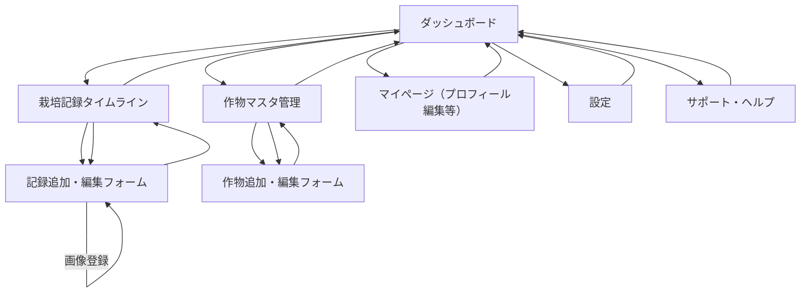

# 画面遷移図

本ドキュメントは「CultivationDiary」アプリの主要画面間の遷移関係を示します。

- 画面遷移は主にナビゲーションバーやボタン操作によるもの。
- 記録・作物の追加/編集はそれぞれ専用フォーム画面。
- 記録フォーム内で画像登録（カメラ/ファイル選択）は画面遷移を伴わず同一画面内で完結。
- マイページ・設定・サポートはダッシュボードから遷移。
- 認証・権限による分岐は省略。
