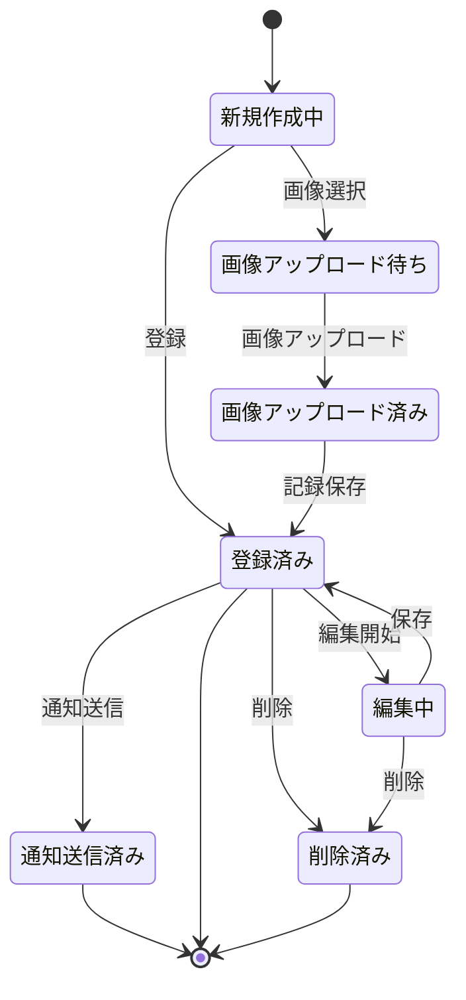
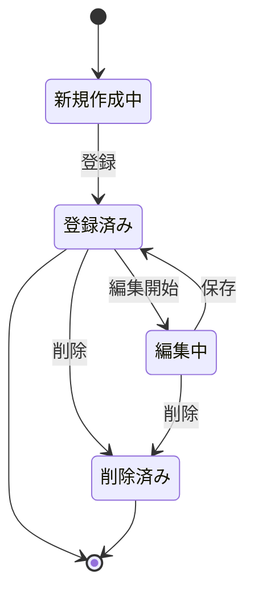
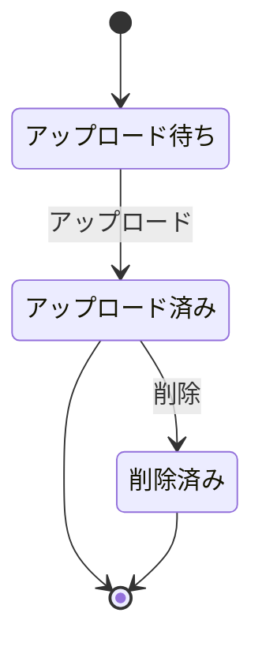
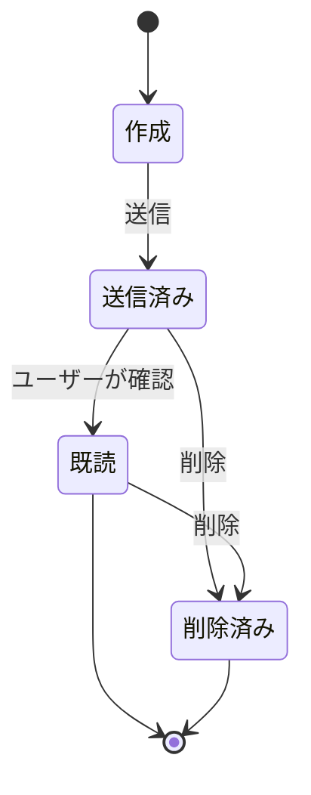

# 状態遷移図

本ドキュメントは「CultivationDiary」アプリの主要なデータ・エンティティの状態遷移を示します。

## 栽培記録（Event）状態遷移

- 「新規作成中」…入力フォームで作成中の状態
- 「画像アップロード待ち」…画像選択後、アップロード前の状態
- 「画像アップロード済み」…画像がアップロードされた状態
- 「登録済み」…DB等に保存されている通常状態
- 「編集中」…既存記録を編集している状態
- 「通知送信済み」…リマインダー等の通知が送信された状態
- 「削除済み」…削除操作後の状態（論理削除・物理削除は実装方針による）

## 作物（Crop）状態遷移

## 画像（Image）状態遷移

## 通知（Notification）状態遷移

- 必要に応じて他エンティティも追記してください。
