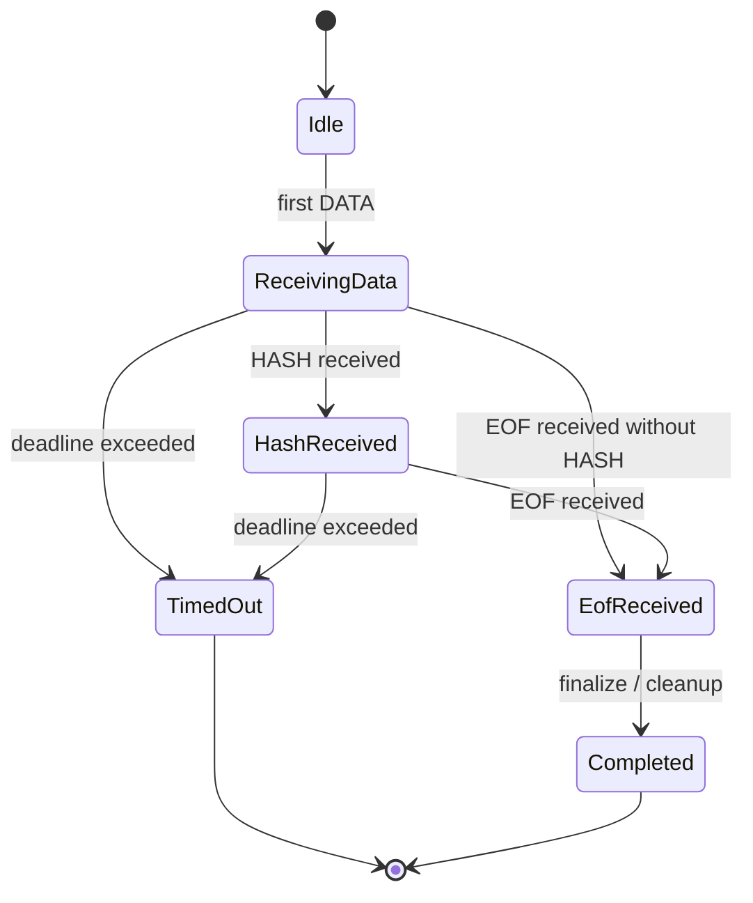
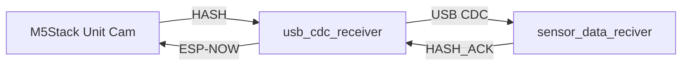
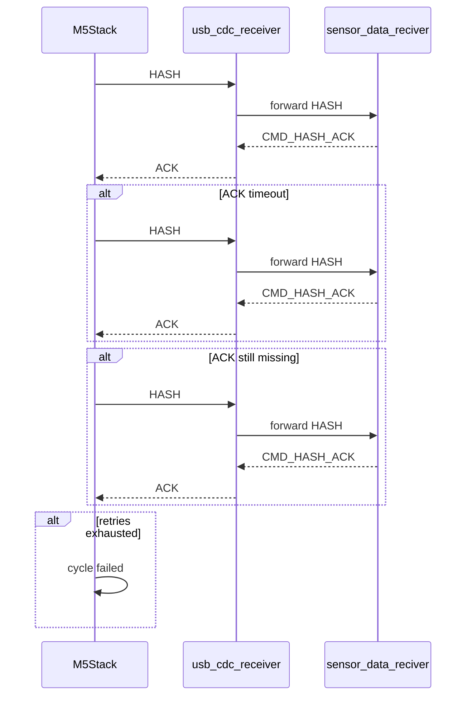

# HASH 受信保証と欠落検知の設計

## 1. 背景

現在のデータ経路は以下です。

`devices/m5stack_unit_cam` -> `server/usb_cdc_receiver` -> `server/sensor_data_reciver` -> `InfluxDB`

画像は保存できている一方で、`voltage` だけが欠落する事象が発生しています。  
現状の `voltage` は `HASH` フレームにのみ載っており、`HASH` が欠落すると InfluxDB に記録されません。

このため、以下を分離して扱う必要があります。

* `HASH` の受信保証
* `HASH` 欠落時の検知と警告
* データ面とログ面の分離

本設計は、堅牢性を優先しつつ、待ち続けて停止しない構成にします。

---

## 2. 目的

1. `sensor_data_reciver` に sender 単位のサイクル状態機械を導入する
1. `EOF` 時点で `HASH` 欠落を明示的に警告する
1. `HASH_ACK` を導入して `HASH` の受信保証を実現する
1. `HASH` 再送を実装する
1. `usb_cdc_receiver` のログが本番データ面に混入しないようにする

---

## 3. 非目的

* 画像 DATA の配送方式を全面的に変更すること
* InfluxDB のスキーマを変更すること
* ESP-NOW 全体の再設計をすること
* `sensor_data_reciver` をブロッキング待ちに変えること

---

## 4. 全体方針

### 方針 1: 受信保証は ACK と再送で行う

`HASH` は「来るまで待つ」のではなく、以下で保証します。

* `sensor_data_reciver` が `HASH` を受信したら `HASH_ACK` を返す
* `m5stack_unit_cam` が `HASH_ACK` を確認する
* `HASH_ACK` が来なければ `HASH` を再送する
* 最大回数に達したらサイクル失敗として終了する

### 方針 2: 欠落検知は状態機械とタイムアウトで行う

受信側は永遠に待ちません。

* sender 単位で状態を保持する
* `EOF` 時に `HASH` 未受信なら警告する
* 一定時間で状態を破棄する

### 方針 3: ログはデータ面と分離する

本番では `usb_cdc_receiver` のログがデータ面に流れないことを保証します。

* データ搬送チャネルに `info!` を流さない
* 必要なら UART 側へログ出力を切り替える
* 少なくとも本番設定では `warn` / `error` のみに制限する

---

## 5. 現状の課題

### 5.1 `HASH` が単発でしか送られていない

`m5stack_unit_cam` は画像送信後に `HASH` を 1 回だけ送っています。  
したがって `HASH` の配送失敗を取りこぼしやすいです。

### 5.2 受信側にサイクル状態がない

現状は `HASH` を受信できたかどうかの状態が暗黙です。  
`EOF` で `voltage_cache` がなければ警告は出せますが、これは欠落検知として弱いです。

### 5.3 ログ混入がある

`usb_cdc_receiver` のログ文字列がデータ面に見えています。  
これにより短い `HASH` が埋もれる可能性があります。

---

## 6. Phase 分割

### Phase 1: `sensor_data_reciver` にサイクル状態機械を追加する

対象:

* `server/sensor_data_reciver/protocol/serial_handler.py`
* `server/sensor_data_reciver/protocol/streaming_handler.py`
* 共通化できるなら `server/sensor_data_reciver/protocol/cycle_tracker.py`

目的:

* sender 単位で受信サイクルを追跡する
* `HASH` が来たか、`EOF` が来たかを明示する
* `EOF` 時の欠落警告を明示化する

### Phase 2: `EOF` 時の HASH 欠落警告を明示化する

対象:

* Phase 1 の状態機械

目的:

* `EOF` 到着時に `HASH` 未受信なら警告を残す
* 受信欠落・順序逆転・破損のいずれかを区別できるログにする

### Phase 3: `HASH_ACK` を導入する

対象:

* `devices/m5stack_unit_cam`
* `server/usb_cdc_receiver`
* `server/sensor_data_reciver`

目的:

* `HASH` 受信後に ACK を返す
* ACK を中継して送信元へ返す

### Phase 4: `HASH` 再送を実装する

対象:

* `devices/m5stack_unit_cam`

目的:

* `HASH_ACK` が来なければ再送する
* 最大回数を超えたらサイクル失敗として終了する

### Phase 5: ログ経路の分離を確認する

対象:

* `server/usb_cdc_receiver`
* デプロイ設定

目的:

* 本番でデータ面にログが混入しないようにする
* 受信保証の前提を崩さない

---

## 7. Phase 1/2 の状態機械

### 7.1 管理単位

管理単位は `sender_mac` ごとです。  
各 sender について 1 サイクルを追跡します。

### 7.2 管理する状態

* `cycle_state`
* `cycle_started_at`
* `last_event_at`
* `hash_received`
* `hash_value`
* `voltage`
* `temperature`
* `tds_voltage`
* `eof_received`
* `warning_emitted`

### 7.3 推奨状態

* `Idle`
* `ReceivingData`
* `HashReceived`
* `EofReceived`
* `TimedOut`
* `Completed`

### 7.4 状態遷移図



### 7.5 受信イベントごとの動作

#### DATA 受信

* サイクルがなければ新規作成する
* `ReceivingData` に遷移する
* `last_event_at` を更新する

#### HASH 受信

* `hash_received = true` にする
* `HashReceived` に遷移する
* InfluxDB に書き込む
* Phase 3 以降は `HASH_ACK` を返す

#### EOF 受信

* `hash_received == true` なら正常完了扱い
* `hash_received == false` なら警告を出す
* サイクルを終了状態へ進める

#### タイムアウト

* sender 単位の状態を破棄する
* 破棄時に `HASH` 未受信なら警告を出す
* 次サイクルの受信を妨げない

---

## 8. EOF 時の HASH 欠落警告

### 8.1 警告条件

以下の条件を満たしたら警告します。

* `EOF` を受信した
* その sender の `hash_received == false`

### 8.2 警告メッセージ例

* `EOF received but HASH was not received for <mac>`
* `Cycle closed without HASH for <mac>, voltage was not written to InfluxDB`

### 8.3 追加で残すべき情報

* sender MAC
* 最後に受信したフレーム種別
* サイクル開始からの経過時間
* 直近の DATA 受信時刻
* バッファ破棄の有無

### 8.4 受信不能時の扱い

* `EOF` までに `HASH` が来なければ、そのサイクルは失敗扱い
* `sensor_data_reciver` は停止しない
* 状態は必ず破棄する

---

## 9. `HASH_ACK` 設計

### 9.1 ACK の目的

ACK は以下のために使います。

* `HASH` が受信できたことを送信元に知らせる
* `HASH` 再送の根拠にする
* `EOF` 前に voltage の配送成功を確定する

以降は、概念上の ACK を `HASH_ACK`、wire 上の実際のコマンド名を `CMD_HASH_ACK` と呼び分けます。
本設計書では、`HASH_ACK` は概念、`CMD_HASH_ACK` は USB CDC 上のテキストコマンドを意味します。

### 9.2 ACK の形式

既存の `CMD_SEND_ESP_NOW` と同じく、テキストコマンド方式を維持します。

推奨フォーマット:

```text
CMD_HASH_ACK:XX:XX:XX:XX:XX:XX:<hash>:<status>\n
```

例:

```text
CMD_HASH_ACK:34:ab:95:fb:3f:c4:0123456789abcdef:OK
```

`status` は将来拡張のため残します。  
当面は `OK` のみでもよいです。
`split(':')` 前提で扱う場合は、期待パーツ数は 9 です。
終端は既存コマンドと同様に改行 `\n` を付ける前提にします。この改行は payload に含めません。
受信側は `split(':')` の前に `trim` / `strip` を行い、`status` に改行が残らないようにします。
`hash` は `:` を含めない固定長の 16 進小文字文字列を前提にします。
現時点の実装では `devices/m5stack_unit_cam/src/core/data_prep.rs` の `simple_image_hash()` が生成する 16 文字の識別子を使い、`DUMMY_HASH` の 64 文字値はダミー専用として扱います。

### 9.3 なぜ `hash` を含めるか

* 同じ sender から複数サイクルが続いても識別できる
* 重複 ACK の判定がしやすい
* 再送時の整合性確認に使える

### 9.4 ACK の経路



---

## 10. `HASH` 再送設計

### 10.1 再送の目的

`HASH` を 1 回しか送らないのが現在の弱点です。  
再送を入れることで、短い制御フレームの信頼性を上げます。

### 10.2 推奨値

* `HASH_ACK_TIMEOUT_MS = 1000`
* `HASH_MAX_RETRIES = 3`
* `HASH_RETRY_BACKOFF_MS_LIST = [250, 500, 1000]`

### 10.3 選定理由

* `HASH` は小さいため、1 秒あれば通常は十分
* 3 回までなら全体遅延を抑えられる
* それ以上は異常系と判断してよい

### 10.4 再送フロー



### 10.5 再送の終了条件

* ACK を受信したら終了
* 最大回数に達したら終了
* 送信不能ならサイクル失敗扱いで終了

### 10.6 ハング防止

* ACK 待ちは必ずタイムアウト付き
* `sensor_data_reciver` は待機しない
* `m5stack_unit_cam` も無限再送しない

---

## 11. ログ経路の分離

### 11.1 目的

本番運用では、`usb_cdc_receiver` のログが `sensor_data_reciver` へ流れないことを保証します。

### 11.2 方針

* データ面とログ面を分ける
* `info!` の大量出力を本番で禁止する
* 必要ならログの出力先を UART 側に変更する

### 11.3 実装候補

1. `usb_cdc_receiver` の本番ビルドでは `warn` / `error` のみに制限する
1. デバッグ時のみ詳細ログを有効化する feature を追加する
1. 可能なら logging backend を USB CDC 以外へ分離する

### 11.4 受け入れ条件

* 本番運用で `usb_cdc_receiver` のログが `sensor_data_reciver` の受信データに混入しない
* `HASH` の受信率が安定する

---

## 12. 影響範囲

### `sensor_data_reciver`

* `serial_handler.py`
* `streaming_handler.py`
* 共有状態管理モジュールの追加候補

### `usb_cdc_receiver`

* `command.rs`
* `main.rs`
* `esp_now/sender.rs`
* ログ設定

### `m5stack_unit_cam`

* `core/data_service.rs`
* `communication/esp_now/sender.rs`
* `communication/esp_now/frame_codec.rs`

---

## 13. 実装順

1. Phase 1 と Phase 2 を実装する
1. 受信側で `HASH` 欠落警告が正しく出ることを確認する
1. Phase 3 と Phase 4 で ACK / 再送を入れる
1. Phase 5 でログ経路を分離する

---

## 14. 検証観点

* `HASH` が届いた場合に InfluxDB に voltage が保存される
* `EOF` が来たのに `HASH` が無い場合に警告が出る
* `HASH_ACK` が返る
* ACK が無い場合に再送される
* 再送回数超過でハングしない
* 本番でログがデータ面に混入しない
