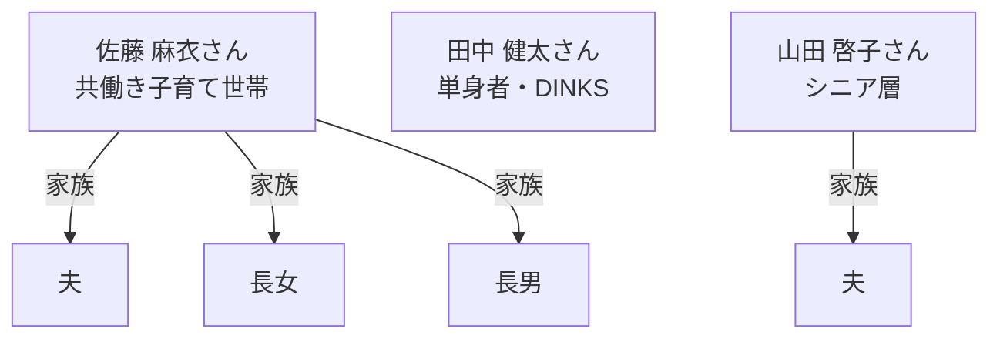

# ペルソナ

## 1. 忙しい共働き子育て世帯（佐藤 麻衣さん）
- 30代後半、IT企業広報職、夫と小学生・幼稚園児の子ども2人
- 東京都目白駅近くのマンション（ルーフバルコニー付き）
- 忙しくても子どもに食育をしたい、安全な野菜を手軽に育てたい
- 新しいテクノロジーやエコ活動に関心あり
- 手間なく、スマホで管理できる栽培システムを求めている

## 2. 新しい趣味や癒しを求める単身者・DINKS（田中 健太さん）
- 20代後半、Web系エンジニア、単身
- 目白駅周辺のワンルームマンション（ベランダ付き）
- 忙しいがQOL向上や新しい趣味に興味あり
- おしゃれで手軽、スマートな栽培体験を求めている
- 虫や土いじりが苦手、インテリア性も重視

## 3. 健康志向の高いシニア層（山田 啓子さん）
- 60代前半、定年退職、夫と二人暮らし
- 目白駅近くの分譲マンション（広めのベランダ）
- 健康維持や生きがい、コミュニティ参加を重視
- 身体に負担なく、簡単に続けられる栽培を希望
- サポートやマニュアルが充実していると安心

## ペルソナ相関図

