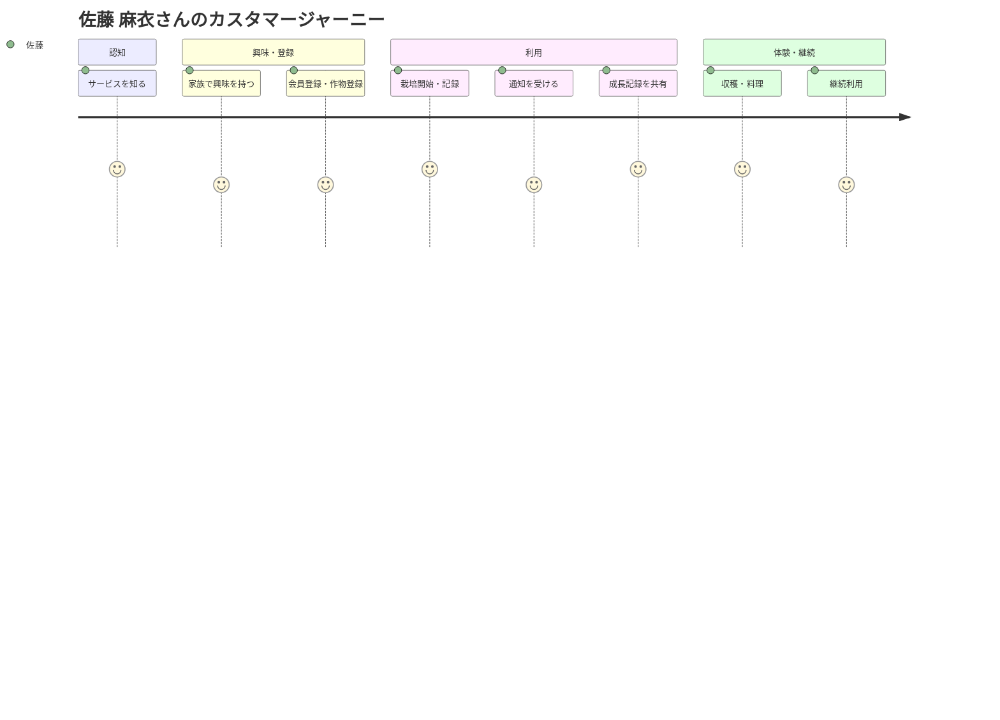
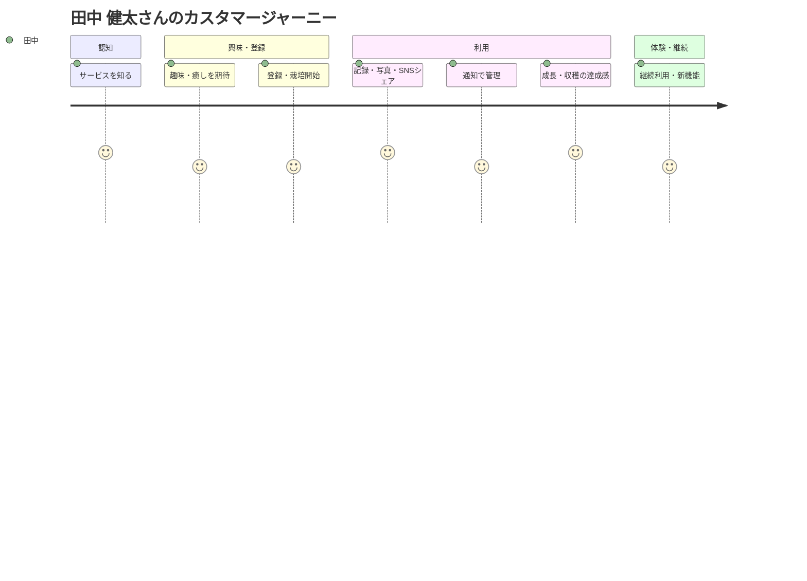
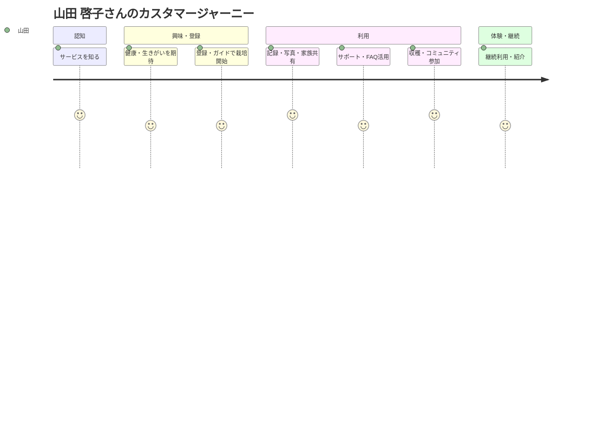

# カスタマージャーニー（家庭菜園栽培記録サービス）

## カスタマージャーニーマップ（例：佐藤 麻衣さん）

## カスタマージャーニーマップ（例：田中 健太さん）

## カスタマージャーニーマップ（例：山田 啓子さん）

## 1. 忙しい共働き子育て世帯（佐藤 麻衣さん）
### 主な行動・体験
1. サービスを知る（SNS/口コミ/広告）
2. 家族で「食育」や「安心野菜」に興味を持つ
3. スマホで会員登録・作物マスタ登録
4. 栽培開始・イベント記録（子どもと一緒に写真・コメント）
5. 水やり・収穫などの通知を受ける
6. 成長記録を家族で閲覧・共有
7. 収穫した野菜で料理・食卓体験
8. 継続利用・他の作物にも挑戦

### タッチポイント
- スマホアプリ/ブラウザ
- カメラ・写真
- 通知（リマインダー）
- 家族共有機能

### 感情・課題
- 忙しい中でも手軽に記録できる安心感
- 子どもと一緒に楽しめる体験
- 手間がかからないことへの満足

---

## 2. 単身者・DINKS（田中 健太さん）
### 主な行動・体験
1. サービスを知る（Web/友人/ガジェット系メディア）
2. 趣味・癒し・QOL向上を期待して登録
3. ベランダで栽培開始・記録
4. おしゃれな写真・記録をSNSでシェア
5. スマート通知で水やり・収穫を忘れず管理
6. 成長や収穫の達成感を味わう
7. 継続利用・新しい作物や機能に興味

### タッチポイント
- スマホ/PC
- SNS連携
- 通知

### 感情・課題
- 忙しくても続けられる手軽さ
- インテリア性・SNS映え
- 新しい趣味としての満足感

---

## 3. 健康志向の高いシニア層（山田 啓子さん）
### 主な行動・体験
1. サービスを知る（家族/友人/地域コミュニティ）
2. 健康維持・生きがいを求めて登録
3. 操作ガイドを見ながら栽培開始
4. 記録・写真を家族や友人と共有
5. サポート・FAQで不明点を解消
6. 収穫の喜び・コミュニティ参加
7. 継続利用・他者への紹介

### タッチポイント
- タブレット/PC/スマホ
- サポート・FAQ
- 家族・友人との共有

### 感情・課題
- 操作の簡単さ・安心感
- 健康や生きがいへの満足
- サポート体制への信頼

---

## まとめ
- すべてのペルソナで「手軽さ」「安心感」「共有・体験価値」が重要
- タッチポイント（スマホ/通知/共有/SNS/サポート）を意識した設計が必要
- 継続利用・体験価値向上のための仕組み（リマインダー、ガイド、コミュニティ等）が重要
