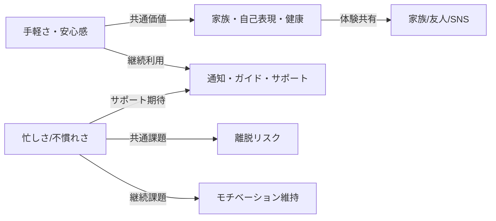

# ユーザー価値・課題の明確化

## 1. 忙しい共働き子育て世帯（佐藤 麻衣さん）
### ユーザー価値
- 子どもと一緒に食育体験ができる
- 忙しくても手間なく安心・安全な野菜を育てられる
- 家族で成長記録を共有し、思い出を残せる
- スマホで簡単に管理・記録できる
### 課題
- 忙しさで水やりや管理を忘れがち
- 家庭菜園の知識や経験が少ない
- 虫や失敗への不安
- 継続的なモチベーション維持

---

## 2. 単身者・DINKS（田中 健太さん）
### ユーザー価値
- 忙しい生活の中でも癒しや達成感を得られる
- おしゃれな記録やSNSシェアで自己表現できる
- スマートな通知で手間なく管理できる
- 新しい趣味・QOL向上
### 課題
- 忙しさで世話を忘れがち
- 虫や土いじりへの抵抗感
- 継続利用の動機付け
- インテリア性やデザインへのこだわり

---

## 3. 健康志向の高いシニア層（山田 啓子さん）
### ユーザー価値
- 健康維持や生きがいを得られる
- 家族や友人と成果を共有できる
- 操作が簡単で安心して使える
- サポートやガイドが充実している
### 課題
- ITや新しいサービスへの不安
- 身体的な負担や複雑な操作への抵抗
- 困った時のサポート体制への期待
- 継続利用のための簡単さ・安心感

---

## 共通の価値・課題
### 価値
- 手軽さ・安心感・体験の共有
- 継続利用しやすい仕組み
- 生活の質や家族・コミュニティとのつながり向上
### 課題
- 忙しさや不慣れさによる離脱リスク
- モチベーション維持
- サポート・ガイド・通知などの仕組みの充実

## 視覚化（価値・課題マップ）

