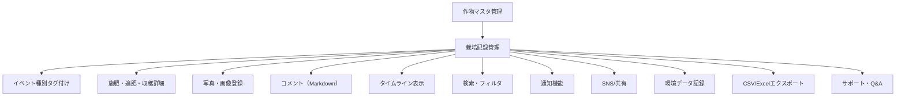

# 機能要件・非機能要件の明確化

## 1. 機能要件
### 基本機能
- 作物マスタ管理（登録・編集・削除）
- 栽培記録（イベント）管理（登録・閲覧・編集・削除）
- イベント種別タグ付け（播種、定植、施肥、追肥、収穫、防除、その他）
- 施肥・追肥・収穫時の「どの作物に」「どのくらい」入力
- 写真撮影・画像登録（スマホカメラ対応）
- コメント（Markdown形式）入力
- 栽培記録のタイムライン表示
- 記録の検索・フィルタリング

### 付加機能・拡張性
- 作業担当者の記録（複数ユーザー対応）
- 天候・気温・湿度などの環境データ記録
- レシピ提案や食育イベント連携
- SNSシェア・家族/友人との共有
- 通知機能（リマインダー、プッシュ通知）
- CSV/Excelエクスポート
- コミュニティ・Q&A・サポート

## 2. 非機能要件
- パフォーマンス（快適なレスポンス、画像アップロードの高速化）
- セキュリティ（認証・認可、画像・個人情報の保護）
- アクセシビリティ（高齢者・子どもでも使いやすいUI）
- レスポンシブ対応（スマホ・タブレット・PC）
- 多言語対応（日本語・英語など）
- サポート・ヘルプ・ガイドの充実
- バックアップ・リストア機能
- 拡張性（新機能追加や外部サービス連携のしやすさ）

## 3. 価値・課題対応表

| ユーザー価値・課題 | 対応する主な機能 |
|--------------------|------------------|
| 手軽さ・安心感 | スマホ対応UI、通知機能、サポート・ガイド |
| 体験の共有 | 家族/友人共有、SNSシェア、タイムライン表示 |
| 継続利用 | リマインダー通知、ガイド、Q&A・サポート |
| 忙しさ・不慣れさ | 自動化通知、簡単操作UI、ヘルプ |
| モチベーション維持 | 成長記録、達成感の可視化、レシピ提案 |
| 健康・生きがい | 栽培記録、コミュニティ機能 |

## 視覚化（機能マップ）

