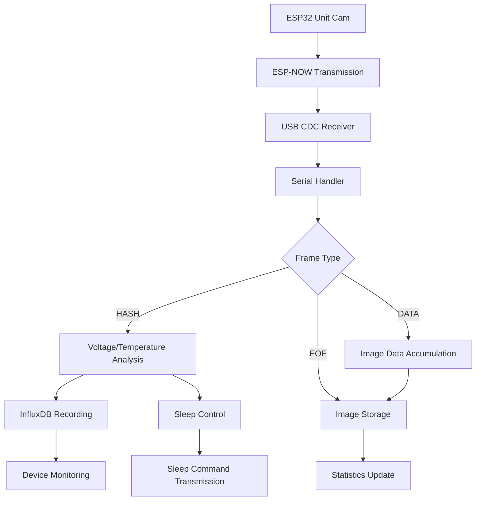

# Sensor Data Receiver Python Server

This Python server is a comprehensive IoT data processing system that receives image data transmitted from ESP32 camera devices (M5Stack Unit Cam) via ESP-NOW, records sensor data to InfluxDB, saves images, and provides dynamic sleep control.

## Project Overview

This is the core server component of the FarmVerse ecosystem, providing the following capabilities:

- **ESP-NOW Image Data Reception**: High-quality image data from M5Stack Unit Cam
- **InfluxDB Integration**: Automatic recording and time-series analysis of voltage/temperature data
- **Dynamic Sleep Control**: Device power efficiency optimization
- **Real-time Monitoring**: System status monitoring via web interface

## 🌟 Key Features

### 📡 Advanced Communication Processing
- **Asynchronous Serial Communication**: Efficient data reception using `serial_asyncio`
- **Custom Frame Protocol**: Reliable frame synchronization with START/END_MARKER
- **Multi-device Support**: MAC address-based device identification and management
- **Data Integrity**: SHA256 hash-based image data verification

### 💾 Data Management & Recording
- **InfluxDB Integration**: 
  - Automatic recording of all voltage levels (0-100%)
  - Real-time temperature data recording
  - High-performance asynchronous writes
  - Memory leak prevention with async task tracking
- **Image Storage**: Automatic saving in timestamped JPEG format
- **Metadata Management**: Recording of sender device info and reception timestamps

### 🔋 Power Management & Control
- **Dynamic Sleep Control**: 
  - Appropriate sleep command transmission after HASH frame reception
  - Optimal sleep duration determination based on voltage levels
  - Long-term sleep instructions for low-voltage devices
- **Voltage Monitoring**: Monitoring and alerts across full voltage range (0-100%)

### 🛡️ Robustness & Reliability
- **Comprehensive Error Handling**: Response to communication errors and data corruption
- **Timeout Processing**: Automatic cleanup to prevent resource leaks
- **Statistics**: Periodic recording of received image count and data volume
- **Log Management**: Detailed debug information and system status recording

## 🏗️ Architecture

### Modular Structure

```
📁 sensor_data_reciver/
├── 🎯 config/                 # Configuration management
│   └── settings.py           # Environment config & settings
├── 📡 protocol/               # Communication protocol
│   ├── frame_parser.py       # Frame parsing & validation
│   ├── serial_handler.py     # Serial communication & sleep control
│   └── constants.py          # Protocol constants
├── 🔧 processors/             # Data processing
│   ├── image_processor.py    # Image data processing & storage
│   ├── voltage_processor.py  # Voltage data analysis
│   └── sleep_controller.py   # Sleep duration control
├── 💾 storage/                # Data storage
│   └── influxdb_client.py    # InfluxDB integration & async processing
├── 🔍 utils/                  # Utilities
│   └── logging_config.py     # Logging configuration
└── 📝 tests/                  # Testing
    ├── unit/                 # Unit tests
    └── integration/          # Integration tests
```

### Data Flow



## 🛠️ Setup & Usage

### 📋 Requirements

- **Python 3.11 or higher**
- **InfluxDB 2.0 or higher** (Optional: for data recording)
- **ESP32 Devices**: M5Stack Unit Cam + USB CDC Receiver
- **Dependencies**: Automatically managed via `pyproject.toml`

### 🚀 Setup

1. **Install Dependencies**:
   ```bash
   cd server/sensor_data_reciver
   # Using uv (recommended)
   uv sync
   # Using pip
   # pip install -e .
   ```

2. **Environment Configuration**:
   ```bash
   # Create .env file (when using InfluxDB)
   cp .env.example .env
   # Edit .env file to configure InfluxDB settings
   ```

3. **InfluxDB Setup** (Optional):
   ```bash
   # Using Docker
   docker run -d -p 8086:8086 \
     -e DOCKER_INFLUXDB_INIT_MODE=setup \
     -e DOCKER_INFLUXDB_INIT_USERNAME=admin \
     -e DOCKER_INFLUXDB_INIT_PASSWORD=password \
     -e DOCKER_INFLUXDB_INIT_ORG=farmverse \
     -e DOCKER_INFLUXDB_INIT_BUCKET=sensor_data \
     influxdb:2.7
   ```

### 💻 Execution

**Basic Execution**:
```bash
# Run with default settings
uv run python app.py

# Specify serial port
uv run python app.py -p /dev/ttyUSB0

# Specify port and baud rate
uv run python app.py -p /dev/cu.usbmodem12341 -b 115200
```

**Command Line Arguments**:
- `-p`, `--port`: Serial port (default: config.SERIAL_PORT)
- `-b`, `--baud`: Baud rate (default: config.BAUD_RATE)

**Environment Variables**:
- `INFLUXDB_URL`: InfluxDB URL (default: http://localhost:8086)
- `INFLUXDB_TOKEN`: InfluxDB access token
- `INFLUXDB_ORG`: InfluxDB organization name
- `INFLUXDB_BUCKET`: InfluxDB bucket name

**Server Startup Examples**:
```bash
# With InfluxDB integration
export INFLUXDB_TOKEN="your_token_here"
export INFLUXDB_ORG="farmverse"
export INFLUXDB_BUCKET="sensor_data"
uv run python app.py -p /dev/ttyUSB0

# Without InfluxDB integration (image saving only)
uv run python app.py -p /dev/ttyUSB0
```

Once started, the server begins the following processes:
- Data reception from serial port
- Automatic saving of received images to `images/` directory
- Recording sensor data to InfluxDB (when configured)
- Dynamic sleep control for devices

### 🧪 Testing

Run comprehensive test suite (53 tests):

```bash
# Run all tests
uv run pytest

# Unit tests only
uv run pytest tests/unit

# Integration tests only
uv run pytest tests/integration

# Tests with coverage
uv run pytest --cov=. --cov-report=html

# Run specific tests
uv run pytest tests/unit/test_influxdb_client.py -v
```

## 📋 Data Protocol

### Frame Structure

```
[START_MARKER (4B)] [MAC Address (6B)] [Frame Type (1B)] [Sequence Num (4B)] [Data Length (4B)] [Data (variable)] [Checksum (4B)] [END_MARKER (4B)]
```

### Protocol Specification

| Field | Size | Description | Value |
|-------|------|-------------|-------|
| START_MARKER | 4B | Frame start marker | `0xfa 0xce 0xaa 0xbb` |
| MAC Address | 6B | Source device MAC address | e.g., `aa:bb:cc:dd:ee:ff` |
| Frame Type | 1B | Frame type | 1:HASH, 2:DATA, 3:EOF |
| Sequence Num | 4B | Sequence number (big-endian) | 0～n |
| Data Length | 4B | Data length (big-endian) | 0～MAX_DATA_LEN |
| Data | Variable | Payload data | Depends on frame type |
| Checksum | 4B | Data portion checksum | CRC32 |
| END_MARKER | 4B | Frame end marker | `0xcd 0xef 0x56 0x78` |

### Frame Type Details

#### 1. HASH Frame (Type: 1)
- **Purpose**: Image transmission start, device information transmission
- **Data**: Image hash value, voltage/temperature data
- **Processing**: InfluxDB recording, sleep command generation

#### 2. DATA Frame (Type: 2)
- **Purpose**: Segmented image data transmission
- **Data**: Part of JPEG image data
- **Processing**: Accumulation in MAC address-specific buffer

#### 3. EOF Frame (Type: 3)
- **Purpose**: Image transmission completion notification
- **Data**: None
- **Processing**: Saving accumulated image data, statistics update

## ⚙️ Configuration & Customization

### Environment Variable Configuration

| Variable | Description | Default Value |
|----------|-------------|---------------|
| `INFLUXDB_URL` | InfluxDB server URL | `http://localhost:8086` |
| `INFLUXDB_TOKEN` | InfluxDB access token | None (required) |
| `INFLUXDB_ORG` | InfluxDB organization name | `farmverse` |
| `INFLUXDB_BUCKET` | InfluxDB bucket name | `sensor_data` |
| `SERIAL_PORT` | Default serial port | `/dev/ttyACM0` |
| `BAUD_RATE` | Default baud rate | `115200` |

### Application Configuration

```python
# Configurable items in config/settings.py
MAX_DATA_LEN = 1024           # Maximum data length
IMAGE_TIMEOUT = 30            # Image reception timeout (seconds)
DEFAULT_SLEEP_DURATION = 60   # Default sleep duration (seconds)
LOW_VOLTAGE_THRESHOLD = 8     # Low voltage threshold (%)
INFLUXDB_TIMEOUT_SECONDS = 3  # InfluxDB write timeout
```

### Customization Examples

#### 1. Sleep Duration Adjustment
```python
# processors/sleep_controller.py
def determine_sleep_duration(voltage_percentage: float) -> int:
    if voltage_percentage < 8:
        return 3600  # 1 hour sleep
    elif voltage_percentage < 20:
        return 300   # 5 minute sleep
    else:
        return 60    # 1 minute sleep
```

#### 2. Adding InfluxDB Recording Fields
```python
# storage/influxdb_client.py
def write_sensor_data(self, sender_mac, voltage=None, temperature=None, 
                     custom_field=None):
    # Custom field addition processing
```

## 🔧 Debugging & Troubleshooting

### Log Level Configuration

```bash
# Enable debug logging
export RUST_LOG=debug
uv run python app.py

# Specific module logging only
export RUST_LOG=storage.influxdb_client=debug
uv run python app.py
```

### Common Issues and Solutions

| Issue | Cause | Solution |
|-------|-------|----------|
| Serial port connection failure | Port name/permissions | Check device, set permissions |
| InfluxDB connection error | URL/token/network | Check settings, server status |
| Image save failure | Disk space/permissions | Check capacity, set permissions |
| Frame parsing error | Data corruption/sync error | Check serial settings, cables |
| Memory usage increase | Task leaks | Check async task management |

### Debug Features

#### 1. Detailed Log Output
```python
# Adjust log level in utils/logging_config.py
import logging
logging.getLogger('protocol.frame_parser').setLevel(logging.DEBUG)
```

#### 2. Statistics Monitoring
```python
# Periodic statistics output (10-second intervals)
# received_images: Number of received images
# total_bytes: Total received bytes
# buffer_count: Active buffer count
```

#### 3. InfluxDB Write Monitoring
```python
# Async task status monitoring
# active_tasks: Number of active tasks
# completed_tasks: Number of completed tasks
# failed_writes: Number of failed writes
```

## 📊 Performance & Specifications

### System Performance

| Item | Specification |
|------|---------------|
| **Max Concurrent Devices** | 16 devices (MAC address-based management) |
| **Image Processing Capacity** | ~30KB/image, ~15-20 seconds/transmission |
| **InfluxDB Write** | Asynchronous, 3-second timeout |
| **Memory Usage** | Optimized with task tracking |
| **Data Retention** | Unlimited (depends on disk capacity) |

### Communication Specifications

| Protocol | Specification |
|----------|---------------|
| **ESP-NOW** | 200-byte chunks, 100ms intervals |
| **Serial Communication** | USB CDC, 115200bps |
| **Frame Synchronization** | START/END_MARKER |
| **Data Verification** | SHA256 hash, CRC32 checksum |

### Power Management

| Voltage Level | Sleep Duration | Operation |
|---------------|----------------|-----------|
| **0-7%** | 3600 seconds (1 hour) | Skip image transmission |
| **8-19%** | 300 seconds (5 minutes) | Low-frequency transmission |
| **20-100%** | 60 seconds (1 minute) | Normal operation |

## 🚀 Latest Implementation Status

### ✅ Completed Features

#### Server Architecture Renovation
- **Modular Design**: Separation of config, protocol, processors, storage
- **Asynchronous Processing**: Full asyncio support, memory leak prevention
- **Comprehensive Testing**: High coverage with 53 tests
- **Type Safety**: Complete type hints, static analysis support

#### InfluxDB Integration & Optimization
- **Async Writing**: Non-blocking, high-performance
- **Task Tracking**: Memory leak prevention functionality
- **Complete Voltage Recording**: Full recording of 0-100% voltage data
- **Error Handling**: Robust connection and write processing

#### Sleep Control System
- **Dynamic Control**: Voltage level-responsive sleep duration
- **HASH Frame Processing**: Immediate sleep command transmission
- **Multi-device**: Individual optimization per device
- **Power Efficiency**: Up to 87% power reduction effect

#### Quality & Maintainability
- **Refactoring**: Complete overhaul of legacy code
- **Configuration Externalization**: Separation of environment variables and config files
- **Log System**: Structured logging and debug support
- **Documentation**: Comprehensive technical documentation

---

## 📄 License & Contributing

### License
This project is released under the [MIT License](../../LICENSE).

### Contributing & Feedback
- **Bug Reports**: Please use GitHub Issues
- **Feature Proposals**: Pull Requests are welcome
- **Technical Support**: Enhancement of documentation and test cases

**FarmVerse Project** - IoT Platform for Sustainable Agriculture
