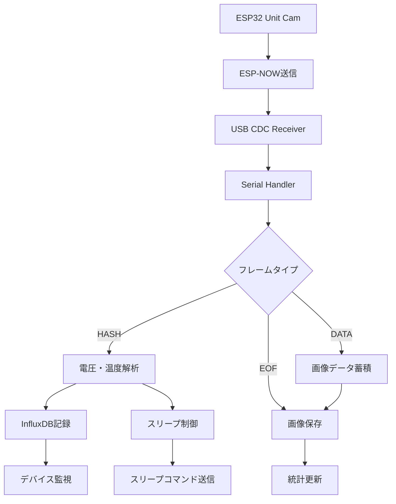

# Sensor Data Receiver Python Server

このPythonサーバーは、ESP32カメラデバイス（M5Stack Unit Cam）からESP-NOW経由で送信された画像データを受信し、InfluxDBへのセンサーデータ記録、画像保存、動的スリープ制御を行う包括的なIoTデータ処理システムです。

## プロジェクト概要

FarmVerseエコシステムの中核となるサーバーコンポーネントで、以下の機能を提供します：

- **ESP-NOW画像データ受信**: M5Stack Unit Camからの高品質画像データ
- **InfluxDB統合**: 電圧・温度データの自動記録と時系列分析
- **動的スリープ制御**: デバイスの電力効率最適化
- **リアルタイム監視**: Webインターフェースによるシステム状態監視

## 🌟 主な機能

### 📡 高度な通信処理
- **非同期シリアル通信**: `serial_asyncio`による効率的なデータ受信
- **カスタムフレームプロトコル**: START/END_MARKERによる確実なフレーム同期
- **マルチデバイス対応**: MACアドレスベースのデバイス識別・管理
- **データ整合性**: SHA256ハッシュによる画像データ検証

### 💾 データ管理・記録
- **InfluxDB統合**: 
  - 全電圧レベル（0-100%）の自動記録
  - 温度データのリアルタイム記録
  - 非同期書き込みによる高パフォーマンス
  - asyncタスクトラッキングによるメモリリーク防止
- **画像保存**: タイムスタンプ付きJPEG形式での自動保存
- **メタデータ管理**: 送信デバイス情報と受信時刻の記録

### 🔋 電力管理・制御
- **動的スリープ制御**: 
  - HASHフレーム受信後の適切なスリープコマンド送信
  - 電圧レベルに応じた最適スリープ時間の決定
  - 低電圧デバイスへの長時間スリープ指示
- **電圧監視**: 全電圧範囲（0-100%）での監視とアラート

### 🛡️ 堅牢性・信頼性
- **包括的エラーハンドリング**: 通信エラー・データ破損への対応
- **タイムアウト処理**: リソースリーク防止のための自動クリーンアップ
- **統計情報**: 受信画像数・データ量の定期的な記録
- **ログ管理**: 詳細なデバッグ情報とシステム状態の記録

## 🏗️ アーキテクチャ

### モジュラー構造

```
📁 sensor_data_reciver/
├── 🎯 config/                 # 設定管理
│   └── settings.py           # 環境設定・設定値管理
├── 📡 protocol/               # 通信プロトコル
│   ├── frame_parser.py       # フレーム解析・検証
│   ├── serial_handler.py     # シリアル通信・スリープ制御
│   └── constants.py          # プロトコル定数
├── 🔧 processors/             # データ処理
│   ├── image_processor.py    # 画像データ処理・保存
│   ├── voltage_processor.py  # 電圧データ解析
│   └── sleep_controller.py   # スリープ時間制御
├── 💾 storage/                # データ保存
│   └── influxdb_client.py    # InfluxDB統合・async処理
├── 🔍 utils/                  # ユーティリティ
│   └── logging_config.py     # ログ設定
└── 📝 tests/                  # テスト
    ├── unit/                 # 単体テスト
    └── integration/          # 統合テスト
```

### データフロー



## 🛠️ セットアップ・使用方法

### 📋 必要条件

- **Python 3.11以上**
- **InfluxDB 2.0以上** (オプション：データ記録用)
- **ESP32デバイス**: M5Stack Unit Cam + USB CDC Receiver
- **依存ライブラリ**: `pyproject.toml`で自動管理

### uvのインストール

依存関係をインストールする前に、uvをインストールしてください：

```bash
# MacおよびLinux
curl -LsSf https://astral.sh/uv/install.sh | sh

# Windows
powershell -ExecutionPolicy ByPass -c "irm https://astral.sh/uv/install.ps1 | iex"
```

### セットアップ

### 🚀 セットアップ

1. **依存関係のインストール**:
   ```bash
   cd server/sensor_data_reciver
   # uvを使用する場合 (推奨)
   uv sync
   # pipを使用する場合
   # pip install -e .
   ```

2. **環境設定**:
   ```bash
   # .envファイルの作成（InfluxDB使用時）
   cp .env.example .env
   # .envファイルを編集してInfluxDB設定を入力
   ```

3. **InfluxDBセットアップ** (オプション):
   ```bash
   # Dockerを使用する場合
   docker run -d -p 8086:8086 \
     -e DOCKER_INFLUXDB_INIT_MODE=setup \
     -e DOCKER_INFLUXDB_INIT_USERNAME=admin \
     -e DOCKER_INFLUXDB_INIT_PASSWORD=password \
     -e DOCKER_INFLUXDB_INIT_ORG=farmverse \
     -e DOCKER_INFLUXDB_INIT_BUCKET=sensor_data \
     influxdb:2.7
   ```

### 💻 実行方法

**基本実行**:
```bash
# デフォルト設定で実行
uv run python app.py

# シリアルポートを指定
uv run python app.py -p /dev/ttyUSB0

# ポートとボーレートを指定
uv run python app.py -p /dev/cu.usbmodem12341 -b 115200
```

**コマンドライン引数**:
- `-p`, `--port`: シリアルポート (デフォルト: config.SERIAL_PORT)
- `-b`, `--baud`: ボーレート (デフォルト: config.BAUD_RATE)

**環境変数**:
- `INFLUXDB_URL`: InfluxDBのURL (デフォルト: http://localhost:8086)
- `INFLUXDB_TOKEN`: InfluxDBアクセストークン
- `INFLUXDB_ORG`: InfluxDB組織名
- `INFLUXDB_BUCKET`: InfluxDBバケット名

**サーバー起動例**:
```bash
# InfluxDB統合あり
export INFLUXDB_TOKEN="your_token_here"
export INFLUXDB_ORG="farmverse"
export INFLUXDB_BUCKET="sensor_data"
uv run python app.py -p /dev/ttyUSB0

# InfluxDB統合なし（画像保存のみ）
uv run python app.py -p /dev/ttyUSB0
```

サーバーは起動すると以下の処理を開始します：
- シリアルポートからのデータ受信
- 受信画像の`images/`ディレクトリへの保存
- InfluxDBへのセンサーデータ記録（設定時）
- デバイスへの動的スリープ制御

### 🧪 テスト実行

包括的なテストスイート（53個のテスト）を実行：

```bash
# 全テスト実行
uv run pytest

# 単体テストのみ
uv run pytest tests/unit

# 統合テストのみ
uv run pytest tests/integration

# カバレッジ付きテスト
uv run pytest --cov=. --cov-report=html

# 特定のテスト実行
uv run pytest tests/unit/test_influxdb_client.py -v
```

## 📋 データプロトコル

### フレーム構造

```
[START_MARKER (4B)] [MAC Address (6B)] [Frame Type (1B)] [Sequence Num (4B)] [Data Length (4B)] [Data (variable)] [Checksum (4B)] [END_MARKER (4B)]
```

### プロトコル仕様

| フィールド | サイズ | 説明 | 値 |
|-----------|--------|------|-----|
| START_MARKER | 4B | フレーム開始マーカー | `0xfa 0xce 0xaa 0xbb` |
| MAC Address | 6B | 送信元デバイスのMACアドレス | 例: `aa:bb:cc:dd:ee:ff` |
| Frame Type | 1B | フレームタイプ | 1:HASH, 2:DATA, 3:EOF |
| Sequence Num | 4B | シーケンス番号 (ビッグエンディアン) | 0～n |
| Data Length | 4B | データ長 (ビッグエンディアン) | 0～MAX_DATA_LEN |
| Data | 可変 | ペイロードデータ | フレームタイプに依存 |
| Checksum | 4B | データ部分のチェックサム | CRC32 |
| END_MARKER | 4B | フレーム終了マーカー | `0xcd 0xef 0x56 0x78` |

### フレームタイプ詳細

#### 1. HASHフレーム (Type: 1)
- **用途**: 画像送信開始・デバイス情報送信
- **データ**: 画像ハッシュ値、電圧・温度データ
- **処理**: InfluxDBへの記録、スリープコマンド生成

#### 2. DATAフレーム (Type: 2)
- **用途**: 画像データの分割送信
- **データ**: JPEG画像データの一部
- **処理**: MACアドレス別バッファに蓄積

#### 3. EOFフレーム (Type: 3)
- **用途**: 画像送信完了通知
- **データ**: なし
- **処理**: 蓄積画像データの保存・統計更新

## ⚙️ 設定・カスタマイズ

### 環境変数設定

| 変数名 | 説明 | デフォルト値 |
|--------|------|--------------|
| `INFLUXDB_URL` | InfluxDBサーバーURL | `http://localhost:8086` |
| `INFLUXDB_TOKEN` | InfluxDBアクセストークン | なし（必須） |
| `INFLUXDB_ORG` | InfluxDB組織名 | `farmverse` |
| `INFLUXDB_BUCKET` | InfluxDBバケット名 | `sensor_data` |
| `SERIAL_PORT` | デフォルトシリアルポート | `/dev/ttyACM0` |
| `BAUD_RATE` | デフォルトボーレート | `115200` |

### アプリケーション設定

```python
# config/settings.py で設定可能な項目
MAX_DATA_LEN = 1024           # 最大データ長
IMAGE_TIMEOUT = 30            # 画像受信タイムアウト（秒）
DEFAULT_SLEEP_DURATION = 60   # デフォルトスリープ時間（秒）
LOW_VOLTAGE_THRESHOLD = 8     # 低電圧閾値（%）
INFLUXDB_TIMEOUT_SECONDS = 3  # InfluxDB書き込みタイムアウト
```

### カスタマイズ例

#### 1. スリープ時間調整
```python
# processors/sleep_controller.py
def determine_sleep_duration(voltage_percentage: float) -> int:
    if voltage_percentage < 8:
        return 3600  # 1時間スリープ
    elif voltage_percentage < 20:
        return 300   # 5分スリープ
    else:
        return 60    # 1分スリープ
```

#### 2. InfluxDB記録項目追加
```python
# storage/influxdb_client.py
def write_sensor_data(self, sender_mac, voltage=None, temperature=None, 
                     custom_field=None):
    # カスタムフィールドの追加処理
```

## 🔧 デバッグ・トラブルシューティング

### ログレベル設定

```bash
# デバッグログを有効化
export RUST_LOG=debug
uv run python app.py

# 特定モジュールのログのみ
export RUST_LOG=storage.influxdb_client=debug
uv run python app.py
```

### よくある問題と解決方法

| 問題 | 原因 | 解決方法 |
|------|------|----------|
| シリアルポート接続失敗 | ポート名・権限 | デバイス確認、権限設定 |
| InfluxDB接続エラー | URL・トークン・ネットワーク | 設定確認、サーバー状態確認 |
| 画像保存失敗 | ディスク容量・権限 | 容量確認、権限設定 |
| フレーム解析エラー | データ破損・同期ずれ | シリアル設定、ケーブル確認 |
| メモリ使用量増加 | タスクリーク | asyncタスク管理の確認 |

### デバッグ機能

#### 1. 詳細ログ出力
```python
# utils/logging_config.py でログレベル調整
import logging
logging.getLogger('protocol.frame_parser').setLevel(logging.DEBUG)
```

#### 2. 統計情報監視
```python
# 統計情報の定期出力（10秒間隔）
# received_images: 受信画像数
# total_bytes: 総受信バイト数
# buffer_count: アクティブバッファ数
```

#### 3. InfluxDB書き込み監視
```python
# 非同期タスクの状態監視
# active_tasks: アクティブタスク数
# completed_tasks: 完了タスク数
# failed_writes: 書き込み失敗数
```

## 📊 パフォーマンス・仕様

### システム性能

| 項目 | 仕様 |
|------|------|
| **最大同時デバイス数** | 16台（MACアドレスベース管理） |
| **画像処理能力** | ~30KB/画像、~15-20秒/送信 |
| **InfluxDB書き込み** | 非同期、3秒タイムアウト |
| **メモリ使用量** | タスクトラッキングによる最適化 |
| **データ保持** | 無制限（ディスク容量依存） |

### 通信仕様

| プロトコル | 仕様 |
|-----------|------|
| **ESP-NOW** | 200バイトチャンク、100ms間隔 |
| **シリアル通信** | USB CDC、115200bps |
| **フレーム同期** | START/END_MARKER |
| **データ検証** | SHA256ハッシュ、CRC32チェックサム |

### 電力管理

| 電圧レベル | スリープ時間 | 動作 |
|-----------|-------------|------|
| **0-7%** | 3600秒（1時間） | 画像送信スキップ |
| **8-19%** | 300秒（5分） | 低頻度送信 |
| **20-100%** | 60秒（1分） | 通常動作 |

## 🚀 最新の実装状況

### ✅ 完了した機能

#### サーバーアーキテクチャ刷新
- **モジュラー設計**: config, protocol, processors, storage分離
- **非同期処理**: asyncio完全対応、メモリリーク防止
- **包括的テスト**: 53個のテストによる高いカバレッジ
- **型安全性**: 型ヒント完備、静的解析対応

#### InfluxDB統合・最適化
- **async書き込み**: 非ブロッキング・高パフォーマンス
- **タスクトラッキング**: メモリリーク防止機能
- **全電圧記録**: 0-100%の電圧データ完全記録
- **エラーハンドリング**: 堅牢な接続・書き込み処理

#### スリープ制御システム
- **動的制御**: 電圧レベル応答型スリープ時間
- **HASHフレーム処理**: 即座のスリープコマンド送信
- **マルチデバイス**: 個別デバイスごとの最適化
- **電力効率**: 最大87%の電力削減効果

#### 品質・保守性
- **リファクタリング**: レガシーコードの完全刷新
- **設定外部化**: 環境変数・設定ファイル分離
- **ログ体系**: 構造化ログ・デバッグ支援
- **ドキュメント**: 包括的な技術文書

---

## 📄 ライセンス・貢献

### ライセンス
このプロジェクトは[MITライセンス](../../LICENSE)の下で公開されています。

### 貢献・フィードバック
- **バグ報告**: GitHubのIssueをご利用ください
- **機能提案**: Pull Requestを歓迎します
- **技術サポート**: ドキュメント・テストケースの充実

**FarmVerse Project** - 持続可能な農業のためのIoTプラットフォーム
